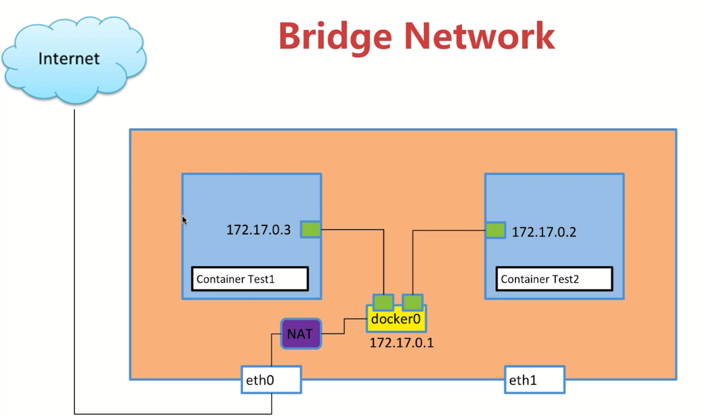
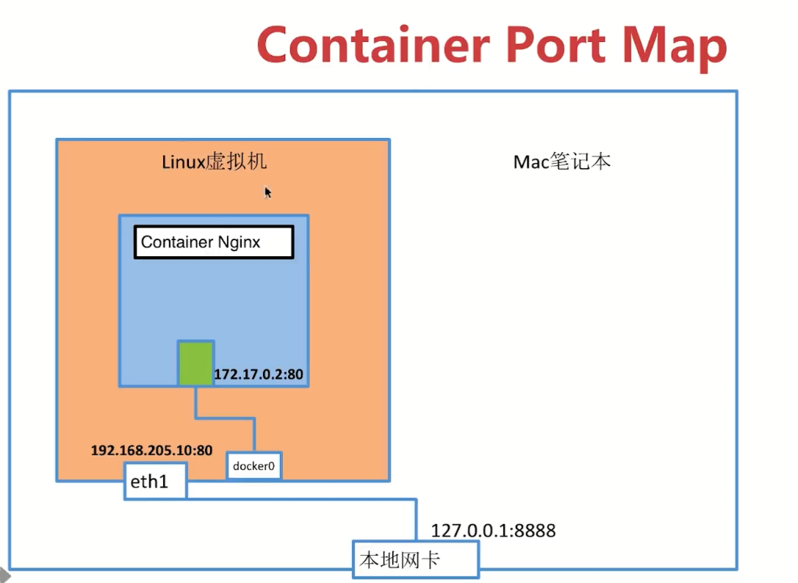
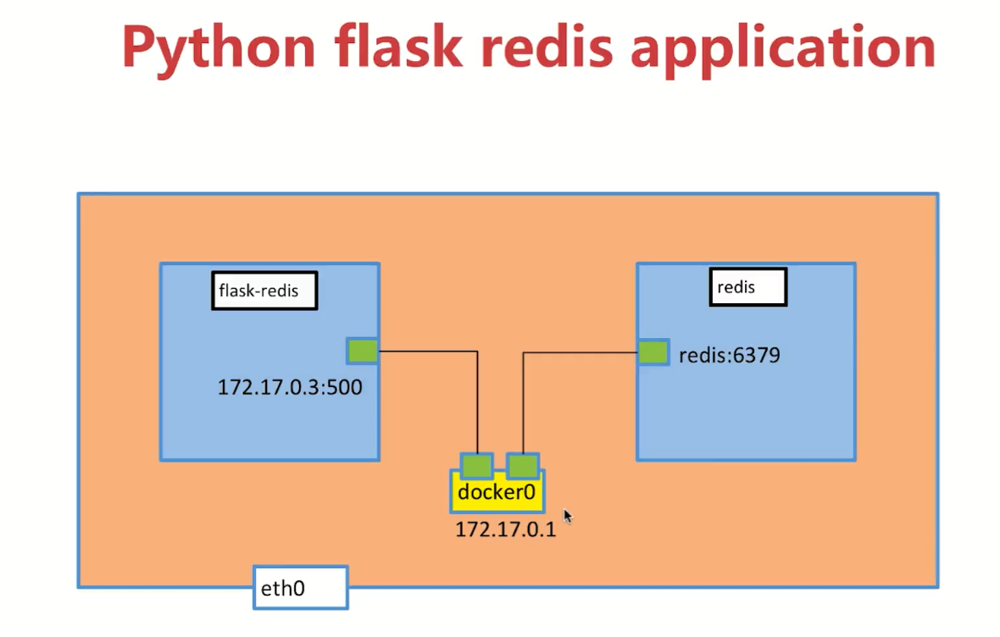
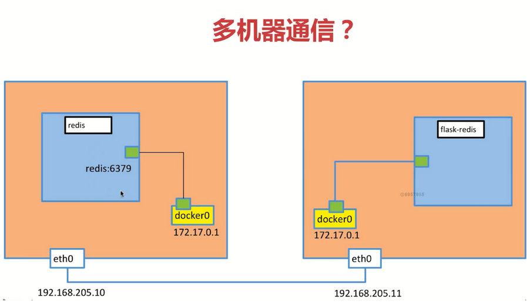
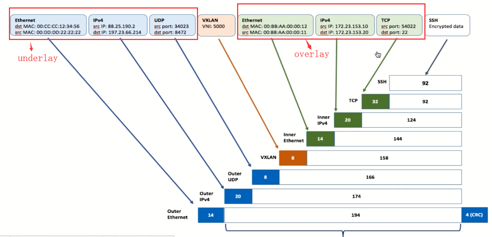

## docker 网络
### 单机网络
	+ bridge network
	+ host   network
	+ none   network
### 多机网络
### linux 网络命令空间
```
######################### 通过创建容器的方式，自动创建2个不同的网络命名空间 ############################
docker pull busybox
docker run -d --name test1 busybox /bin/sh -c "while true; do sleep 3600; done"  ## 创建一个容器同时生成网络命令空间
docker exec -it 容器id  /bin/sh           ## 进入容器的bash
ip a                                      ## 查看ip
exit
ip a                                     ## docker host中的网络信息和容器内部是隔离的，属于不同的网络命名空间，
docker run -d --name test2 busybox /bin/sh -c "while true; do sleep 3600; done"  ## 生成第二个网络命令空间
docker exec 容器id ip a                  ##  执行shell，查看ip，不进入
docker exec -it 容器id  /bin/sh          ## 进入容器的bash
ping test1的ip                           ## 测试不能ping通，关闭docker host的iptables就可以访问，在两个不同的container中？？？可以采用link或者自定义的bridge网络
##########################  手动创建网络命名空间 ####################################################
1. 创建网络命名空间[test1,test2]
2. 创建一对veth pair,[veth-test1, veth-test2]
3. 将veth pair连接到命名空间
4. 设置网络命名空间的ip地址和对应的端口
5. 开启对应网络命名空间的端口
6. 测试，在test1的命名空间ping test2命名空间的ip，能互通
======= 命令演示============
sudo ip netns list                                 查看本机有的网络namespace
sudo ip netns delelte test1 	                   删除test1的network namespace
sudo ip netns add  test1 		                   创建test1的network namespace
sudo ip netns exec test1 ip a                      在test1的namespace执行ip a命令
sudo ip netns exec test1 ip link                   此时是down
sudo ip netns exec test1 ip link set dev lo up    #开启test1的网络命名空间的lo网口
sudo ip netns exec test1 ip link  # 此时变成unknown，需要两端连起来才可以，本地的lo回环口也是unknown状态 
sudo ip link                      # 本地的lo回环口也是unknown状态 
sudo ip link add veth-test1 type veth peer name veth-test2   ## 新建一对veth pair
sudo ip link 
sudo ip netns exec test1 ip link 
sudo ip link set veth-test1 netns test1                      ## 把veth挂到namespace test1
sudo ip netns exec test1 ip link                             ## test1里面多了一个端口,宿主机就没有这个link了
sudo ip link                                                 ## 本地的就没有了veth-test1
sudo ip link set veth-test2 netns test2                      ## 把veth挂到namespace test2
sudo ip netns exec test2 ip link                             ## test2里面多了一个端口,宿主机就没有这个link了
sudo ip link                                                 ## 本地的就没有了veth-test2
sudo ip netns exec test1 ip addr add 192.168.1.1/24 dev veth-test1   在test1的namespace给dev veth-test1端口添加ip地址
sudo ip netns exec test2 ip addr add 192.168.1.2/24 dev veth-test2   在test2的namespace给dev veth-test1端口添加ip地址
sudo ip netns exec test2 ip link                            ## 此时还是没有ip地址，状态是down
sudo ip netns exec test1 ip link set dev veth-test1 up      ## 把端口开启
sudo ip netns exec test2 ip link set dev veth-test2 up      ## 把端口开启
sudo ip netns exec test1 ip a                               ## 此时ip地址有了，端口已经up，这样两个就可以互连了
sudo ip netns exec test1 ping 192.168.1.2                   ## 在test1 ping test2的地址
```
###  Docker Bridge0

```
sudo docker network ls       			## 查看当前机器有哪些网络
sudo docker network inspect 网络id		## 查看网络id的详细情况
ip a会出现docker0（本机）和veth的端口（连接的端口），这样就可以把这个端口和docker容器内的端口链接起来，是一对veth pair
sudo docker exec test1 ip a
怎么确定本地的docker0和veth pair其中一个端口是连接的呢，使用brctl
sudo yum install bridge-uitls 先安装一下
brctl show 
```
### link 是单向的，用的不多
当我们一个应用去访问一个db的时候，db的ip是变化的，所以此时可以考虑采用link的方式
```
docker run -d --name test1 busybox /bin/sh -c "while true; do sleep 3600; done" 
docker run -d --name test2 --link test1 busybox /bin/sh -c "while true; do sleep 3600; done" 
sudo docker exec -it test2 /bin/sh
ping test1的ip   ip可达
ping test1      link的名字也可以
exit
sudo docker network create -d bridge my-bridge   # 创建自定义的bridge
sudo docker network ls
brctl show
docker run -d --name test3 --network my-bridge busybox /bin/sh -c "while true; do sleep 3600; done" 
brctl show   
sudo docker network inspect my-bridge
sudo docker network connect my-bridge test2   # 修改网络，把test2挂到my-bridge，此时test2连接有两个bridge
自定义的bridge的两个容器默认是link好的，除了ip能访问，也可以使用name
```

### container port map
```
sudo docker run --name web -d nginx     
sudo docker ps
sudo docker exec -it web /bin/bash   ## 此时的nginx比较简单，没有任何命令，如何暴露访问呢？
exit
如何查看nginx服务的ip地址呢？
sudo docker network inspect bridge
ping 上面查询的ip
telnet ipxx  80
curl http://ipxxx:80   可以访问，如果让外面也能访问呢，需要用到端口映射(port mapping)，把container 80端口映射到container host的80端口，此时不用访问container的ip，直接访问container host ip 即可
sudo docker stop web
sudo docker rm web
sudo docker run --name web -d -p 80:80 nginx   创建一个webcontainer把container的端口映射到本地container host的80端口
sudo docker ps
curl 127.0.0.1
```


### host & none
#### none  
场景： 例如密码生成工具，或者存储，可以考虑这种网络方式 ？用的少
```
创建一个test1 容器，并把网络挂到none上
docker run -d --name test1 --network none busybox /bin/sh -c "while true; do sleep 3600; done"
sudo docker ps
sudo docker network inspect none     发现没有ip地址和mac地址
sudo docker exec -it test1 /bin/sh
ip a  发现只有一个loopback，没有其他的接口
```
### host
```
sudo docker stop test1
sudo docker rm test1
docker run -d --name test1 --network host busybox /bin/sh -c "while true; do sleep 3600; done"
sudo docker network  inspect host    发现没有ip地址和mac地址
sudo docker exec -it test1 /bin/sh
ip a 		发现 接口和container host的接口是一样的，这种模式没有自己的network namespace，跟主机共享network namespace，这种模式会出现container端口和host出现端口冲突
```
### 多容器部署

python flask 访问redis
+ redis
```
sudo docker run -d -name redis redis    # 启动一个redis的container
sudo ps
```
+ python flask project
```
sudo docker build -t peterhly/flask-redis .
sudo docker image ls
## -d 后台运行，--link和redis做一个单向绑定，在flask-redis容器内可以通过这个link访问redis
## -e 在当前的容器设置一个环境变量REDIS_HOST=redis
sudo docker run -d --link redis --name flask-redis -e REDIS_HOST=redis  peterhly/flask-redis
sudo docker exec -it flask-redis /bin/bash
env   
ping redis
curl http://127.0.0.1:5000
curl http://127.0.0.1:5000
curl http://127.0.0.1:5000  执行多次
exit
此时外面无法访问curl http://127.0.0.1:5000，没有port map
sudo docker stop flask-redis
sudo docker rm flask-redis
sudo docker run -d -p 5000:5000 --link redis --name flask-redis -e REDIS_HOST=redis  peterhly/flask-redis
此时本地就可以访问 curl http://127.0.0.1:5000
```


### Overlay和Underlay
+ [vxlan](https://www.evoila.de/de/blog/2015/11/06/what-is-vxlan-and-how-it-works/)

+ 多机器通信

需要一个分布式存储[etcd](https://coreos.com/etcd/),解决ip地址的分配问题
#### 1. setup etcd  cluster
在docker-node1上

```
vagrant@docker-node1:~$ wget https://github.com/coreos/etcd/releases/download/v3.0.12/etcd-v3.0.12-linux-amd64.tar.gz
vagrant@docker-node1:~$ tar zxvf etcd-v3.0.12-linux-amd64.tar.gz
vagrant@docker-node1:~$ cd etcd-v3.0.12-linux-amd64
vagrant@docker-node1:~$ nohup ./etcd --name docker-node1 --initial-advertise-peer-urls http://192.168.205.10:2380 \
--listen-peer-urls http://192.168.205.10:2380 \
--listen-client-urls http://192.168.205.10:2379,http://127.0.0.1:2379 \
--advertise-client-urls http://192.168.205.10:2379 \
--initial-cluster-token etcd-cluster \
--initial-cluster docker-node1=http://192.168.205.10:2380,docker-node2=http://192.168.205.11:2380 \
--initial-cluster-state new&
```


在docker-node2上

```
vagrant@docker-node2:~$ wget https://github.com/coreos/etcd/releases/download/v3.0.12/etcd-v3.0.12-linux-amd64.tar.gz
vagrant@docker-node2:~$ tar zxvf etcd-v3.0.12-linux-amd64.tar.gz
vagrant@docker-node2:~$ cd etcd-v3.0.12-linux-amd64/
vagrant@docker-node2:~$ nohup ./etcd --name docker-node2 --initial-advertise-peer-urls http://192.168.205.11:2380 \
--listen-peer-urls http://192.168.205.11:2380 \
--listen-client-urls http://192.168.205.11:2379,http://127.0.0.1:2379 \
--advertise-client-urls http://192.168.205.11:2379 \
--initial-cluster-token etcd-cluster \
--initial-cluster docker-node1=http://192.168.205.10:2380,docker-node2=http://192.168.205.11:2380 \
--initial-cluster-state new&
```

检查cluster状态

```
vagrant@docker-node2:~/etcd-v3.0.12-linux-amd64$ ./etcdctl cluster-health
member 21eca106efe4caee is healthy: got healthy result from http://192.168.205.10:2379
member 8614974c83d1cc6d is healthy: got healthy result from http://192.168.205.11:2379
cluster is healthy
```
#### 2.重启docker服务
在docker-node1上

```
$ sudo service docker stop
$ sudo /usr/bin/dockerd -H tcp://0.0.0.0:2375 -H unix:///var/run/docker.sock --cluster-store=etcd://192.168.205.10:2379 --cluster-advertise=192.168.205.10:2375&
```

在docker-node2上

```
$ sudo service docker stop
$ sudo /usr/bin/dockerd -H tcp://0.0.0.0:2375 -H unix:///var/run/docker.sock --cluster-store=etcd://192.168.205.11:2379 --cluster-advertise=192.168.205.11:2375&
```

#### 4.创建overlay network

在docker-node1上创建一个demo的overlay network

```
vagrant@docker-node1:~$ sudo docker network ls
NETWORK ID          NAME                DRIVER              SCOPE
0e7bef3f143a        bridge              bridge              local
a5c7daf62325        host                host                local
3198cae88ab4        none                null                local
vagrant@docker-node1:~$ sudo docker network create -d overlay demo
3d430f3338a2c3496e9edeccc880f0a7affa06522b4249497ef6c4cd6571eaa9
vagrant@docker-node1:~$ sudo docker network ls
NETWORK ID          NAME                DRIVER              SCOPE
0e7bef3f143a        bridge              bridge              local
3d430f3338a2        demo                overlay             global
a5c7daf62325        host                host                local
3198cae88ab4        none                null                local
vagrant@docker-node1:~$ sudo docker network inspect demo
[
    {
        "Name": "demo",
        "Id": "3d430f3338a2c3496e9edeccc880f0a7affa06522b4249497ef6c4cd6571eaa9",
        "Scope": "global",
        "Driver": "overlay",
        "EnableIPv6": false,
        "IPAM": {
            "Driver": "default",
            "Options": {},
            "Config": [
                {
                    "Subnet": "10.0.0.0/24",
                    "Gateway": "10.0.0.1/24"
                }
            ]
        },
        "Internal": false,
        "Containers": {},
        "Options": {},
        "Labels": {}
    }
]
```

我们会看到在node2上，这个demo的overlay network会被同步创建

```
vagrant@docker-node2:~$ sudo docker network ls
NETWORK ID          NAME                DRIVER              SCOPE
c9947d4c3669        bridge              bridge              local
3d430f3338a2        demo                overlay             global
fa5168034de1        host                host                local
c2ca34abec2a        none                null                local
```

通过查看etcd的key-value, 我们获取到，这个demo的network是通过etcd从node1同步到node2的

```
vagrant@docker-node2:~/etcd-v3.0.12-linux-amd64$ ./etcdctl ls /docker
/docker/network
/docker/nodes
vagrant@docker-node2:~/etcd-v3.0.12-linux-amd64$ ./etcdctl ls /docker/nodes
/docker/nodes/192.168.205.11:2375
/docker/nodes/192.168.205.10:2375
vagrant@docker-node2:~/etcd-v3.0.12-linux-amd64$ ./etcdctl ls /docker/network/v1.0/network
/docker/network/v1.0/network/3d430f3338a2c3496e9edeccc880f0a7affa06522b4249497ef6c4cd6571eaa9
vagrant@docker-node2:~/etcd-v3.0.12-linux-amd64$ ./etcdctl get /docker/network/v1.0/network/3d430f3338a2c3496e9edeccc880f0a7affa06522b4249497ef6c4cd6571eaa9 | jq .
{
  "addrSpace": "GlobalDefault",
  "enableIPv6": false,
  "generic": {
    "com.docker.network.enable_ipv6": false,
    "com.docker.network.generic": {}
  },
  "id": "3d430f3338a2c3496e9edeccc880f0a7affa06522b4249497ef6c4cd6571eaa9",
  "inDelete": false,
  "ingress": false,
  "internal": false,
  "ipamOptions": {},
  "ipamType": "default",
  "ipamV4Config": "[{\"PreferredPool\":\"\",\"SubPool\":\"\",\"Gateway\":\"\",\"AuxAddresses\":null}]",
  "ipamV4Info": "[{\"IPAMData\":\"{\\\"AddressSpace\\\":\\\"GlobalDefault\\\",\\\"Gateway\\\":\\\"10.0.0.1/24\\\",\\\"Pool\\\":\\\"10.0.0.0/24\\\"}\",\"PoolID\":\"GlobalDefault/10.0.0.0/24\"}]",
  "labels": {},
  "name": "demo",
  "networkType": "overlay",
  "persist": true,
  "postIPv6": false,
  "scope": "global"
}
```
#### 5.创建连接demo网络的容器

在docker-node1上

```
vagrant@docker-node1:~$ sudo docker run -d --name test1 --net demo busybox sh -c "while true; do sleep 3600; done"
Unable to find image 'busybox:latest' locally
latest: Pulling from library/busybox
56bec22e3559: Pull complete
Digest: sha256:29f5d56d12684887bdfa50dcd29fc31eea4aaf4ad3bec43daf19026a7ce69912
Status: Downloaded newer image for busybox:latest
a95a9466331dd9305f9f3c30e7330b5a41aae64afda78f038fc9e04900fcac54
vagrant@docker-node1:~$ sudo docker ps
CONTAINER ID        IMAGE               COMMAND                  CREATED             STATUS              PORTS               NAMES
a95a9466331d        busybox             "sh -c 'while true; d"   4 seconds ago       Up 3 seconds                            test1
vagrant@docker-node1:~$ sudo docker exec test1 ifconfig
eth0      Link encap:Ethernet  HWaddr 02:42:0A:00:00:02
          inet addr:10.0.0.2  Bcast:0.0.0.0  Mask:255.255.255.0
          inet6 addr: fe80::42:aff:fe00:2/64 Scope:Link
          UP BROADCAST RUNNING MULTICAST  MTU:1450  Metric:1
          RX packets:15 errors:0 dropped:0 overruns:0 frame:0
          TX packets:8 errors:0 dropped:0 overruns:0 carrier:0
          collisions:0 txqueuelen:0
          RX bytes:1206 (1.1 KiB)  TX bytes:648 (648.0 B)

eth1      Link encap:Ethernet  HWaddr 02:42:AC:12:00:02
          inet addr:172.18.0.2  Bcast:0.0.0.0  Mask:255.255.0.0
          inet6 addr: fe80::42:acff:fe12:2/64 Scope:Link
          UP BROADCAST RUNNING MULTICAST  MTU:1500  Metric:1
          RX packets:8 errors:0 dropped:0 overruns:0 frame:0
          TX packets:8 errors:0 dropped:0 overruns:0 carrier:0
          collisions:0 txqueuelen:0
          RX bytes:648 (648.0 B)  TX bytes:648 (648.0 B)

lo        Link encap:Local Loopback
          inet addr:127.0.0.1  Mask:255.0.0.0
          inet6 addr: ::1/128 Scope:Host
          UP LOOPBACK RUNNING  MTU:65536  Metric:1
          RX packets:0 errors:0 dropped:0 overruns:0 frame:0
          TX packets:0 errors:0 dropped:0 overruns:0 carrier:0
          collisions:0 txqueuelen:1
          RX bytes:0 (0.0 B)  TX bytes:0 (0.0 B)

vagrant@docker-node1:~$
```

在docker-node2上

```
vagrant@docker-node2:~$ sudo docker run -d --name test1 --net demo busybox sh -c "while true; do sleep 3600; done"
Unable to find image 'busybox:latest' locally
latest: Pulling from library/busybox
56bec22e3559: Pull complete
Digest: sha256:29f5d56d12684887bdfa50dcd29fc31eea4aaf4ad3bec43daf19026a7ce69912
Status: Downloaded newer image for busybox:latest
fad6dc6538a85d3dcc958e8ed7b1ec3810feee3e454c1d3f4e53ba25429b290b
docker: Error response from daemon: service endpoint with name test1 already exists.
vagrant@docker-node2:~$ sudo docker run -d --name test2 --net demo busybox sh -c "while true; do sleep 3600; done"
9d494a2f66a69e6b861961d0c6af2446265bec9b1d273d7e70d0e46eb2e98d20
```


验证连通性。

```
vagrant@docker-node2:~$ sudo docker exec -it test2 ifconfig
eth0      Link encap:Ethernet  HWaddr 02:42:0A:00:00:03
          inet addr:10.0.0.3  Bcast:0.0.0.0  Mask:255.255.255.0
          inet6 addr: fe80::42:aff:fe00:3/64 Scope:Link
          UP BROADCAST RUNNING MULTICAST  MTU:1450  Metric:1
          RX packets:208 errors:0 dropped:0 overruns:0 frame:0
          TX packets:201 errors:0 dropped:0 overruns:0 carrier:0
          collisions:0 txqueuelen:0
          RX bytes:20008 (19.5 KiB)  TX bytes:19450 (18.9 KiB)

eth1      Link encap:Ethernet  HWaddr 02:42:AC:12:00:02
          inet addr:172.18.0.2  Bcast:0.0.0.0  Mask:255.255.0.0
          inet6 addr: fe80::42:acff:fe12:2/64 Scope:Link
          UP BROADCAST RUNNING MULTICAST  MTU:1500  Metric:1
          RX packets:8 errors:0 dropped:0 overruns:0 frame:0
          TX packets:8 errors:0 dropped:0 overruns:0 carrier:0
          collisions:0 txqueuelen:0
          RX bytes:648 (648.0 B)  TX bytes:648 (648.0 B)

lo        Link encap:Local Loopback
          inet addr:127.0.0.1  Mask:255.0.0.0
          inet6 addr: ::1/128 Scope:Host
          UP LOOPBACK RUNNING  MTU:65536  Metric:1
          RX packets:0 errors:0 dropped:0 overruns:0 frame:0
          TX packets:0 errors:0 dropped:0 overruns:0 carrier:0
          collisions:0 txqueuelen:1
          RX bytes:0 (0.0 B)  TX bytes:0 (0.0 B)

  vagrant@docker-node1:~$ sudo docker exec test1 sh -c "ping 10.0.0.3"
  PING 10.0.0.3 (10.0.0.3): 56 data bytes
  64 bytes from 10.0.0.3: seq=0 ttl=64 time=0.579 ms
  64 bytes from 10.0.0.3: seq=1 ttl=64 time=0.411 ms
  64 bytes from 10.0.0.3: seq=2 ttl=64 time=0.483 ms
  ^C
  vagrant@docker-node1:~$
```


## Refer
[TCP/IP详解](https://book.douban.com/subject/1088054/)
[网络基本功](https://wizardforcel.gitbooks.io/network-basic/content/11.html)
