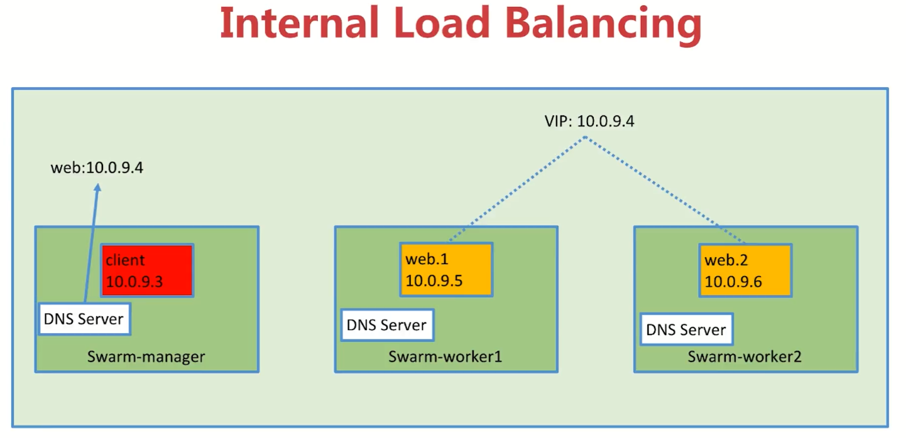
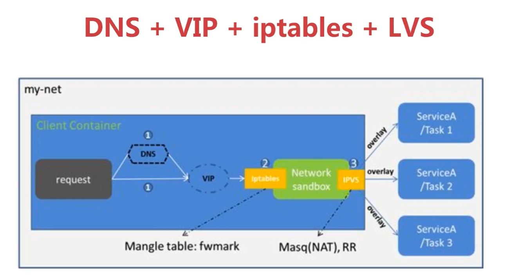
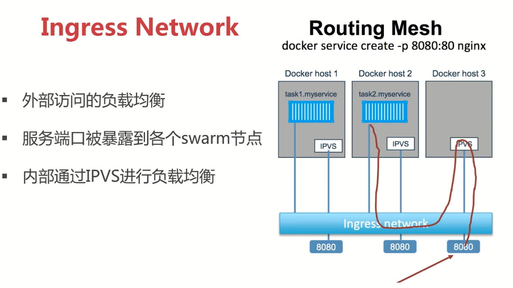
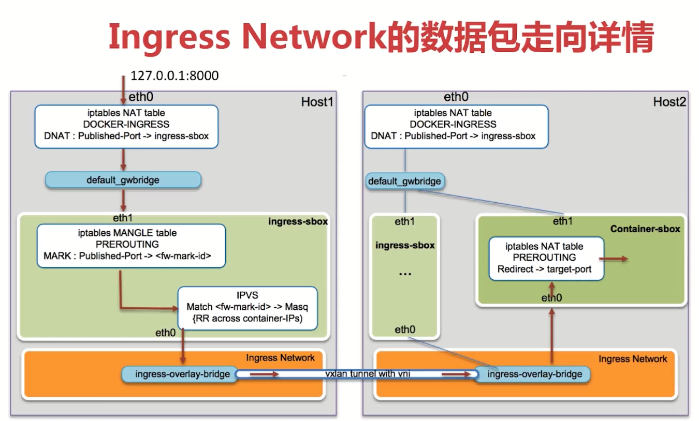
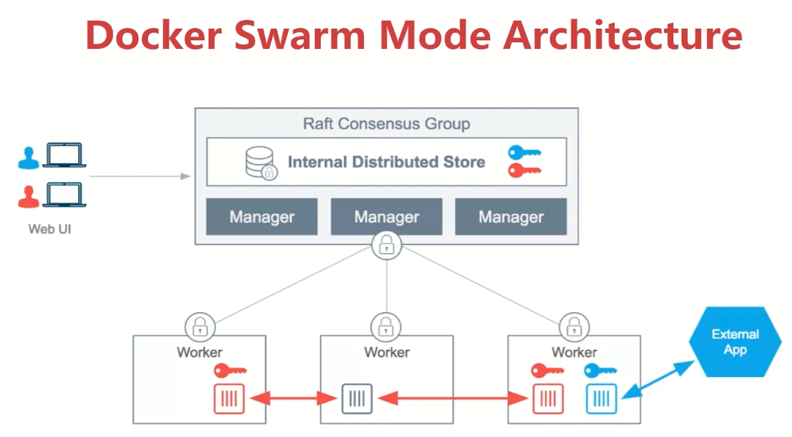

## 容器编排 Swarm mode
### 环境 3 nodes swarm cluster setup
+ vagrant + virtualbox
+ docker machine + virtualbox
+ play with docker https://labs.play-with-docker.com
#### vagrant 方式
```
vagrant up
vagrant ssh swarm-manager 
docker swarm init --advertise-addr=192.168.205.10 
exit
vagrant ssh swarm-worker1
docker swarm join --token xxxx  192.168.205.10:2377
exit
vagrant ssh swarm-manager 
docker node ls
exit
vagrant ssh swarm-worker2
docker swarm join --token xxxx  192.168.205.10:2377
exit
vagrant ssh swarm-manager 
docker node ls
exit
```
####docker-machine
```
docker-machine create swarm-manager
docker-machine create swarm-worker1
docker-machine create swarm-worker1
下面操作类似 vagrant 方式
```
### service的创建维护和水平扩展
```
vagrant ssh swarm-manager
docker service create --name demo busybox /bin/sh -c  "while true; do sleep 3600; done"
docker service ls 
docker service ps demo 
docker ps 容器名字和service不一样
docker service scale demo=5 水平扩展service
docker service ls 
docker service ps demo
vagrant ssh  swarm-worker1 或者swarm-worker2 本地查看docker ps 一下，此时我们删除一个docker rm -f 容器id，
回到manager上发现scale又重新起了一个container，通过 docker service ls 查看一下
docker service rm demo
docker service ps demo 
```
###在swarm集群中通过service部署wordpress
+ 使用命令行的方式部署
```
docker network create -d overlay demo
docker network ls
docker service create --name mysql --env MYSQL_ROOT_PASSWORD=root --env MYSQL_DATABASE=wordpress --network demo  --mount  type=volume,source=mysql-data,destination=/var/lib/mysql  mysql 
docker service ls
docker service ps mysql    看mysql容器在哪里，到对应的机器看一下docker ps 
docker service create --name wordpress -p 80:80 --env WORDPRESS_DB_PASSWORD=root --env WORDPRESS_DB_HOST=mysql     --network demo wordpress
docker service ps network
```
#### 集群服务间通信之Routing Mesh
```
首先确保有一个overlay的network，如果没有可以使用命令创建一个
docker network create -d overlay demo
docker service create --name whoami -p 8000:8000 --network demo -d jwilder/whoami
docker service ls 
docker service ps whoami
到对应的服务器 docker ps 
curl 127.0.0.1:8000
exit
到manager
docker service create --name client -d --network demo busybox /bin/sh -c  "while true; do sleep 3600; done"
docker service ls
docker service ps client 
到对应的服务器运行 docker ps
docker exec -it 容器id sh
ping whoami     ping上面的容器whoami
exit
到manager
docker service scale whoami=2
docker service ps whoami
到对应的client服务器运行 docker ps
docker exec -it 容器id sh    到client机器，进入client的容器
ping whoami                  ping 发现ip还是一样，虽然此时有2个whoami，实际这个是vip（虚拟ip）
nslookup whoami             查询whoami的dns信息，是虚拟ip，不是容器本身的ip
docker exec whoami容器id  ip a   查询容器的ip，跟虚拟ip不是一个
nslookup tasks.whoami           查询的是容器真实的ip
wget whoami:8000
more index.html 
rm -rf index.html
wget whoami:8000
more index.html 
```


Routing Mesh 的两种体现
+ Internal --- Container 和 Container 之间的访问通过overlay网络（通过VIP虚拟ip）
+ Ingress  --- 如果服务有绑定端口，则此服务可以通过任意swarm节点的相应接口访问


```
在没有whoami服务的节点访问，假如work1没有
curl 127.0.0.1:8000 发现有数据返回，就是Ingress network起的作用
sudo iptables -nL -t nat    # 查看本地的转发规则
brctl show
docker network inspect xxxx(bridge名称），转发到ingress-sbox上了
sudo ls /var/run/docker/netns     查看本地的namespace
sudo nsenter --net=/var/run/docker/netns/ingress-sbox   进入ingress-sbox这个namespace
ip a 已经进入到了ingress-box，发现ip就是我们要转发的IP
iptables -nL -t mangle 
exit   退出ingress-box networknamespace,返回work1主机
sudo yum install ipvsadm   lvs的管理工具
sudo nsenter --net=/var/run/docker/netns/ingress-sbox   再进入ingress-sbox这个namespace
iptables -nL -t mangle
ipvsadm -l       可以看到whoami 这两个service的地址【docker exec 服务id ip a】确认一下ip
```

#### Docker Stack 仅限于swarm,类似于单机版本的docker compose
+ 实战1部署Wordpres
```
cd chapter7/labs/wordpress/
more docker-compose.yml
docker stack deploy wordpress --compose-file=docker-compose.yml    ## 创建一个stack
docker stack ls
docker stack ps wordpress          # 查看当前stack里面包含的container
docker stack services wordpress    # 查看当前stack里面包含的service
docker stack rm wordpress          # 删除当前的stack
验证：打开浏览器 http:192.168.205.10:8080
```
+ 实战2 部署vote
	+ stack 默认的network是overlay
	+ 不能通过build方式构建，必须通过image，所以需要先生成image，此例子用的是hub上的example
```
cd chapter7/labs/example-vote-app
docker stack deploy example --compose-file=docker-compose.yml    ## 创建一个名字为example的stack
docker stack ls                    # 查看当前的service数量
docker stack service example       # 查看具体service的的情况
验证：
http://192.168.205.10:5000            # 投票
http://192.168.205.10:5001            # 应该打不开，使用的angular.js 需要翻墙才可以，或者自己build一个image
http://192.168.205.10:8080            # swarm的可视化工具
docker service scale example_vote=3   # 扩容到3
docker stack services example         # 查看example stack的情况
http://192.168.205.10:8080            # swarm的可视化工具，就会把example_vote变成3
docker stack rm example
```
#### Docker Secret管理和使用
通过[Secret RAFT协议](http://thesecretlivesofdata.com/raft/)
##### 什么是Secret？
+ 用户名密码
+ SSH Key
+ TLS 认证
+ 任何不想让别人看到的数据

##### Secret Management
+ 存在Swarm Manage 节点 Raft database 里
+ Secret可以assign给一个service，这个service就能看到这个secret
+ 在container内部secret看起来像文件，但是实际是在内存中
```
1.通过文件方式生成secret
cd chapter7/labs/secret-example
vim password
admin123
退出
docker secret create my-pw password    # 通过文件方式生成一个secret
rm -rf password                        # 为了安全，删除本地的password文件，因为我们在docker secret中已经生成加密的密码
docker secret ls                       # 查看当前docker中存在的secret
2.通过控制台的方式生成secret
echo "adminadmin" | docker secret create my-pw-2 -     # 通过控制台方式生成secret
docker secret ls 
docker secret rm my-pw-2
docker secret ls
```
+ 使用secret
```
docker service create --name client --secret my-pw busybox /bin/sh -c  "while true; do sleep 3600; done"
docker service ls
docker service ps client       # 查看对应的client service所在的机器信息
docker ps                      # 到所在的机器，执行docker ps就可以查看service的详细信息
docker exec -it 容器id  sh     #  进入到容器内部  
cd /run/secrets/
ls
cat my-pw                     # 此时，进入容器内部的查看的passwod是明文
## 创建 mysql的service，指定一个root密码
docker service create --name db --secret my-pw -e MYSQL_ROOT_PASSWORD_FILE=/run/secrets/my-pw mysql 
docker service ls
docker service ps db
进入到对应的service所在的机器
docker ps
docker exec -it 容器id sh 
cat  /run/secrets/my-pw
mysql -u root -p admin123     进入mysql，说明secret生效了
```
+ Docker Secret在Stack中的使用
```
cd chapter7/labs/secret-example
先需要准备secret文件
docker stack deploy wordpress -c=docker-compose.yml
docker stack services wordpress
```
#### Service 的更新
```
docker network ls 
docker network create -d overlay demo
docker service create --name web --publish 8080:5000 --network demo peterhly/python-flask-demo:1.0
docker service ps web   ## 查询web service所在的机器
docker service scale web=2   # 更新之前先把service为web的横向扩展为2，防止更新过程中，访问不中断
docker service ps web
curl 127.0.0.1:8080     返回正常
验证更新过程中是否中断，我们需要做一个测试，首先登陆到一个work上，例如 vagrant ssh swarm-work1
curl 127.0.0.1:8080     返回正常
sh -c "while true; do curl  127.0.0.1:8080&&sleep 1 ; done "   # 每隔1秒访问一次
在我们的manager的服务器进行 service 更新
docker service update --image peterhly/python-flask-demo:2.0 web          ## 更新image到2.0版本
docker service ps web     发现1.0版本的在shutdown
docker service update --publish-rm 8080:5000 --publish-add 8088:5000 web   ##更新端口
## docker stack 更新,还是通过docker stack deploy
docker stack deploy web -c=docker-compose.yml
```
## docker cloud cass-container-as-a-service
+ docker来源于收购的公司tutum，把收购的fig改造成docker-compose
+ 什么是Docker cloud --> 提供容器的管理，编排，部署的托管服务
+ 主要模块  
	+ 关联云服务商Aws，Azure
	+ 添加节点作为Docker Host
	+ 创建服务Service
	+ 创建Stack
	+ image管理
+ 两种模式
	+ Standard模式，一个Node就是一个Docker Host
	+ Swarm模式（beta），多个Node组成的Swarm Cluster