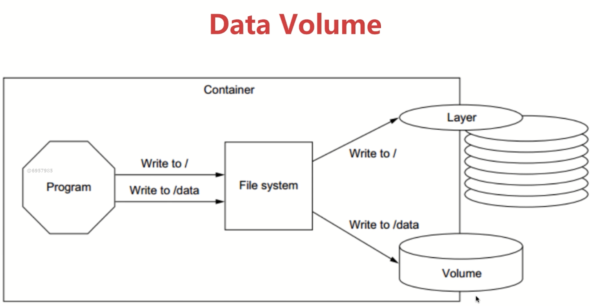

## Docker 持久化

### Docker持久化数据的方案
+ 基于本地文件系统的volume,可以在执行Docker create 或 Docker run时，通过-v参数将主机的目录作为容器的数据卷。这部分功能便是基于本地文件系统的volume管理
+ 基于plugind Volume,支持第三方的存储方案，比如 NAS,aws
### volume类型
+ 受管理的 data Volume,由Docker后台自动创建。
+ 绑定挂载的Volume,具体挂载位置可以由用户指定。
#### 数据持久化： Data Volume
+ 首先需要在Dockerfile中指定Volume,例如mysql image中`VOLUME /var/lib/mysql`
+ volume重命名`docker run -v  mysql:/var/lib/mysql `
```
### 创建失败
### 原因：need to specify one of MYSQL_ROOT_PASSWORD, MYSQL_ALLOW_EMPTY_PASSWORD and MYSQL_RANDOM_ROOT_PASSWORD
sudo docker run -d --name mysql1 -e MYSQL_ALLOW_EMPTY_PASSWORD  mysql  会产生一个volume
sudo docker ps 发现没有，查询一下日志看看
sudo docker logs mysql 
sudo docker rm mysql1
sudo docker volume ls    看一下volume
sudo docker volume rm  xxxxvolumename
###################################### volume 随机 ###################################
sudo docker run -d --name mysql1 -e MYSQL_ALLOW_EMPTY_PASSWORD=true  mysql
sudo docker volume ls
sudo docker volume inspect xxxvolumename
sudo docker run -d --name mysql2 -e MYSQL_ALLOW_EMPTY_PASSWORD=true  mysql
sudo docker volume ls
sudo docker volume inspect xxxvolumename
sudo docker stop mysql1 mysql2
sudo docker rm mysql1 mysql2
sudo docker volume ls      容器删除了，但是volume还存在，名字不够友好，可以先删除,可以起别名
sudo docker volume rm xxxvolumename
###################################### volume name ####################################
###-v mysql:/var/lib/mysql  起一个别名mysql，映射到容器内部的/var/lib/mysql
sudo docker run -d -v mysql:/var/lib/mysql --name mysql1 -e MYSQL_ALLOW_EMPTY_PASSWORD=true  mysql
看一下这个volume是否生效
sudo docker exec -it mysql1 /bin/bash
mysql -u root
show databases;
create database docker;
exit
sudo docker rm -f mysql1  强制删除mysql1
sudo docker volume ls     刚才创建的mysqlvolume还存在
sudo docker run -d -v mysql:/var/lib/mysql --name mysql1 -e MYSQL_ALLOW_EMPTY_PASSWORD=true  mysql
sudo docker exec -it mysql2 /bin/bash
mysql -u root
show dabases;  此时的docker db还存在，说明mysql volume起作用
```
#### 数据持久化： Bind Mouting
+ 设置本地目录和容器目录映射`docker run -v /home/aaa:/root/aaa`，不需要在Dockerfile定义中加上volume
+ 实战1
	+ 1.准备DockerFile,docker-nginx
	```
	FROM nginx:latest
	WORKDIR /usr/share/nginx/html
	COPY index.html index.html
	```
	+ 2. 构建一个image和容器
	```
		docker build -t peterhly/my-nginx .
		docker run -d -p 80:80 --name web peterhly/my-nginx
		docker ps 
		curl 127.0.0.1
		docker rm -f web
		docker run -d -p 80:80 -v $(pwd):/usr/share/nginx/html --name web peterhly/my-nginx
		docker exec -it web /bin/bash
		touch test.txt 在容器内部添加一个文件，exit，发现本地的文件也存在，是同步的
		exit             
			
	``` 
+ 实战2,建议本地运行
	+ 1.准备Dockerfile，目录flask-skeleton
	+ 2.命令
```
docker build -t peterhly/flask-skeleton .
docker image ls
docker run -d -p 80:5000 --name flask  peterhly/flask-skeleton
docker ps
浏览器运行 http://127.0.0.1
docker rm -f flask
docker run -d -p 80:5000  -v $(pwd):/skeleton --name flask  peterhly/flask-skeleton
docker ps
本地修改一个welcome中的文件，保存，此时发现容器的文件也被更新了，方便开发测试，这也是我们dev ops的第一步
```