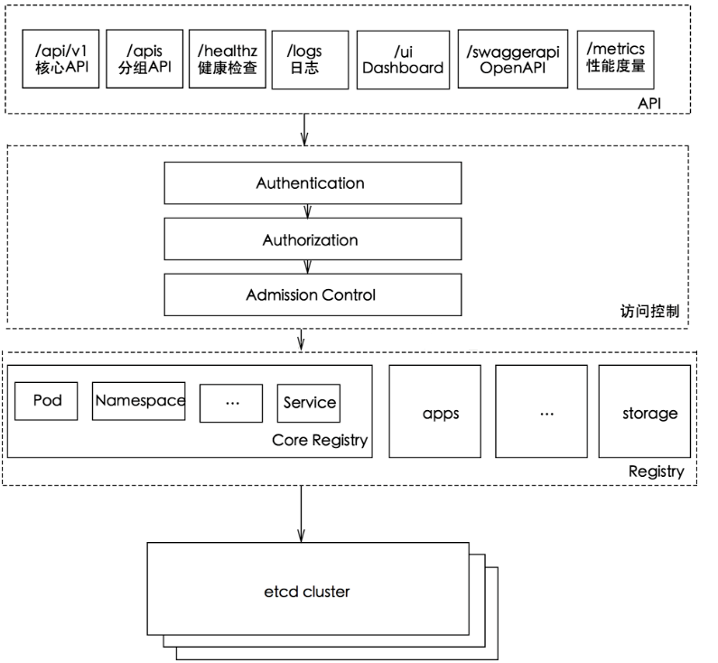

k8s系统将一切事物都抽象为api资源，其遵循rest架构风格组织并管理这些资源及其对象，同时还支持通过标准的http方法对资源进行增删改查等管理操作
### 1.k8s的资源对象
依据资源的主要功能作为分类标准，k8s的api对象大体可分为工作负载（workload）、发现（discovery）和负载均衡（loadbalance）、配置（config）和存储（storage）、集群（cluster）以及元数据（metadate）五个类别。它们基本上都是围绕一个核心目的而设计：如何更好的运行和丰富pod资源，从而为容器化应用提供更灵活、更完善的操作与管理组件
#### 1.1 工作负载型（workload）资源
pod是工作负载型资源中的基础资源，应用程序分为无状态和有状态两种类型，它们对环境的依赖及工作特性有很大不同，因此，分属两种不同类型的pod控制器来管理，replicationcontroller、replicaset和deployment负责管理无状态应用，statefulset用于管理有状态应用。还有些应用较为独特，他们需要在集群中的每个节点上运行单个pod资源，负责收集日志或运行系统服务等任务，这些pod资源的管理则属于daemonset控制器的分内之事。另外，有些容器化应用需要继续运行以守护进程不间断地提供服务，而有些则应该在正常完成后推出，这些在正常完成后就应该退出的容器化应用则由job控制器负责管控
- replicationcontroller：用于确保每个pod副本在任一时刻均能满足目标数量，保证每个容器或容器组总是运行并且可访问；它是上一代的无状态pod应用控制器。
- replicaset：新一代replicationcontroller，它与replicationcontroller的唯一不同之处仅在于支持的标签选择器不同，replicationcontroller只支持等值选择器，而replicaset还额外支持基于集合的选择器。
- deployment：用于管理无状态的持久化应用，它用于为pod和replicaset提供声明式更新，是建构在replicaset之上的更为高级的控制器。
- statefulset：用于管理有状态的持久化应用，其与deployment的不同之处在于statefulset会为每个pod创建一个独有的持久性标识符，并会确保各pod之间的顺序性。
- daemonset：用于确保每个节点都运行了某pod的一个副本，新增的节点一样会被添加此类pod；在节点移除时，此类pod会被回收；daemonset通常用于运行集群存储守护进程，如glusterfs和ceph，还有日志收集进行，如fluentd和logstash，以及监控进程，如prometheus的nodeexporter、collected等
- job：用于管理运行完成后即可终止的应用，例如批处理作业任务，job创建一个或多个pod，并确保其符合目标数量，直到pod正常结束而终止。

#### 1.2.发现和负载均衡：
pod资源可能会因为任何意外故障而被重建，于是它需要固定的可被发现的方式。另外pod资源仅在集群内可见，它的客户端也可能是集群内的其他pod资源，若要开放给外部网络中的用户访问，则需要事先将其暴露到集群外部，并且要为同一种工作负载的访问流量进行负载均衡。k8s使用标准的资源对象来解决此类问题，它们时用于为工作负载添加发现机制及负载均衡功能的service资源和endpoint资源，以及通过七层代理实现请求流量负载均衡的ingress资源

#### 1.3. 配置与存储：
k8s的volume资源支持众多类型的存储设备或存储系统，如glusterfs、ceph rdb和flocker等。configmap资源能够以环境变量或存储卷的方式接入到pod资源的容器中，并且可被多个同类的pod共享引用，从而实现“一次修改，多处生效”。不过，这种方式不适用于存储敏感数据，那是另一类资源类型secret的功能

#### 1.4. 集群级资源：
- pod、deployment、service和configmap等资源属于名称空间级别，k8s还存在一些集群级别的资源，用于定义集群自身配置信息的对象，集群级资源主要包含以下几种类型：
- namespace：资源对象名称的作用范围，默认为“default”。
- node：k8s集群的工作节点，在当前集群中时唯一的。
- role：名称空间级别的由规则组成的权限集合，可被rolebingding引用。
- clusterrole：cluster级别的由规则组成的权限集合，可被rolebinding和clusterrolebinding引用
- rolebinding：将role中的许可权限绑定在一个或一组用户之上，它隶属于且仅能作用于一个名称空间；绑定时，可以引用同一名称空间中的role，也可以引用全局名称空间中的clusterrole
- clusterrolebinding：将clusterrole中定义的许可权限绑定在一个或一组用户之上，它能够引用全局名称空间的clusterrole，并能够通过subject添加相关信息

#### 1.5. 元数据型资源
此类资源对象用于为集群内部的其他资源配置其行为或特性，如horizontalpodautoscaler资源可用于自动伸缩工作负载类型的资源对象的规模，pod模板资源可用于为pod资源的创建预制模板，而limitrange则可为名称空间的资源设置其cpu和内存等系统级资源的数量限制等。

### 2. 资源及其在api中的组织形式
REST是representational state transfer的缩写，意为“表征状态转移”，它是一种程序架构风格，基本元素为资源（resource）、表征（representation）和行为（action）。
资源可以分组为集合（collection），每个集合只包含单一类型的资源，并且各资源间是无序的。资源也可以部署于任何集合，它们称为单体资源。事实上，集合本身也是资源，它可以部署于全局级别，位于api的顶层，也可以包含于某个资源中，表现为“子集合”。
k8s通常利用标准的restful术语来描述api概念:  
资源类型是指在url中使用的名称，如pod、namespace和service等。  
所有资源类型都有一个对应的json表示格式。  
隶属于同一种资源类型的对象组成的列表称为集合。  
某种类型的单个实例称为资源或对象  
kind代表资源对象所属的类型，而这些资源类型大体可以分为三类：对象类、列表类、简单类。  
k8s将api分割为多个逻辑集合，称为api群组，它们支持单独启用或禁用，并能够再次分解。apiserver支持在不同的群组中使用不同的版本，允许各组以不同的速度演进，而且也支持同一群组同时存在不同的版本，如apps/v1、apps/v1beta2、apps/v1beta1等。也因此能够在不同的群组中使用同一个资源类型。群组化管理的api使得其可以更轻松地进行扩展。  
k8s的api以层级结构组织在一起，每个api群组表现为一个以/apis为根路径的rest路径，不过核心群组core有一个专用的简化路径“/api/v1”.目前，常用的api群组分为两类：
核心群组：rest路径为/api/v1，在资源的配置信息apiversion字段中引用时可以不指定路径，而仅给出版本，如“apiVersion：v1”。
命名的群组：rest路径为/apis/$GROUP_NAME/$VERSION，例如/apis/apps/v1，它在apiversion字段中引用的格式为：“apiVersion:$GROUP_NAME/$VERSION”
另外，k8s还支持用户自定义资源类型，目前常用的方式由三种：修改k8s源代码自定义类型、创建一个自定义的apiserver并将其聚合至集群中、使用自定义资源

### 3. api组
```
$ kubectl api-versions　　　　　　#获取当前系统的apiserver上的相关信息
$ kubectl api-resource　　　　　　#获取api资源信
```
#### 3.1 核心组(core group)
又称遗留组(legacy group)，is at the REST path  `/api/v1`  and uses `apiVersion: v1`
#### 3.2 命名组(named group)
at REST path `/apis/$GROUP_NAME/$VERSION`, and use apiVersion: `$GROUP_NAME/$VERSION`(e.g. apiVersion: batch/v1).

#### 3.3. namespaced resources
k8s的api-server组件负责提供restful api访问端点, 并且将数据持久化到etcd server中. 
所谓的namespaced resources,就是这个resource是从属于某个namespace的, 也就是说它不是cluster-scoped的资源. 比如pod, deployment, service都属于namespaced resource. 那么我们看一下如何请求一个namespaced resources.
http://localhost:8080/api/v1/namespaces/default/pods/test-pod
可以看出, 该restful api的组织形式是:

| api  | api版本 | namesapces | 所属的namespaces | 资源种类 | 所请求的资源名称 |
| :--: | :-----: | :--------: | :--------------: | :------: | :--------------: |
| api  |   v1    | namespaces |     default      |   pods   |     test-pod     |


这里api version如果是v1的话,表示这是一个很稳定的版本了, 以后不会有大的修改,并且当前版本所支持的所有特性以后都会兼容. 而如果版本号是v1alpha1, v1beta1之类的,则不保证其稳定性


#### 3.4. non-namespaced resources
http://localhost:8080/apis/rbac.authorization.k8s.io/v1/clusterroles/test-clusterrole
这里可以观察到它clusterrole与pod不同, apis表示这是一个非核心api. rbac.authorization.k8s.io指代的是api-group, 另外它没有namespaces字段, 其他与namespaced resources类似.

#### 3.5. non-resource url
这类资源和pod, clusterrole都不同. 例如
http://localhost:8080/healthz/etcd
这就是用来确认etcd服务是不是健康的.它不属于任何namespace,也不属于任何api版本.
总结, k8s的REST API的设计结构为:
[api/apis]  /  api-group                          / api-version /  namespaces / namespace-name / resource-kind / resource-name
apis          /   rbac.authorization.k8s.io /  v1              /  namespaces / default                  /  roles              /  test-role



- API 层
主要以 REST 方式提供各种 API 接口，针对 Kubernetes 资源对象的 CRUD 和 Watch 等主要 API，还有健康检查、UI、日志、性能指标等运维监控相关的 API。
- 访问控制层
负责身份鉴权，核准用户对资源的访问权限，设置访问逻辑（Admission Control）。
- 注册表层
选择要访问的资源对象。PS：Kubernetes 把所有资源对象都保存在注册表（Registry）中，例如：Pod，Service，Deployment 等等。
- etcd 数据库
保存创建副本的信息。用来持久化 Kubernetes 资源对象的 Key-Value 数据库。

所有的api结构都可以通过访问相关断点来获取信息, 最低一层为api-server的地址, 访问结果如下:
```
{
  "paths": [
    "/api",
    "/api/v1",
    "/apis",
    "/apis/",
    "/apis/admissionregistration.k8s.io",
    "/apis/admissionregistration.k8s.io/v1beta1",
    "/apis/apiextensions.k8s.io",
    "/apis/apiextensions.k8s.io/v1beta1",
    "/apis/apiregistration.k8s.io",
    "/apis/apiregistration.k8s.io/v1",
    "/apis/apiregistration.k8s.io/v1beta1",
    "/apis/apps",
    "/apis/apps/v1",
    "/apis/apps/v1beta1",
    "/apis/apps/v1beta2",
    "/apis/authentication.k8s.io",
    "/apis/authentication.k8s.io/v1",
    "/apis/authentication.k8s.io/v1beta1",
    "/apis/authorization.k8s.io",
    "/apis/authorization.k8s.io/v1",
    "/apis/authorization.k8s.io/v1beta1",
    "/apis/autoscaling",
    "/apis/autoscaling/v1",
    "/apis/autoscaling/v2beta1",
    "/apis/autoscaling/v2beta2",
    "/apis/batch",
    "/apis/batch/v1",
    "/apis/batch/v1beta1",
    "/apis/certificates.k8s.io",
    "/apis/certificates.k8s.io/v1beta1",
    "/apis/coordination.k8s.io",
    "/apis/coordination.k8s.io/v1beta1",
    "/apis/events.k8s.io",
    "/apis/events.k8s.io/v1beta1",
    "/apis/extensions",
    "/apis/extensions/v1beta1",
    "/apis/networking.k8s.io",
    "/apis/networking.k8s.io/v1",
    "/apis/policy",
    "/apis/policy/v1beta1",
    "/apis/rbac.authorization.k8s.io",
    "/apis/rbac.authorization.k8s.io/v1",
    "/apis/rbac.authorization.k8s.io/v1beta1",
    "/apis/scheduling.k8s.io",
    "/apis/scheduling.k8s.io/v1beta1",
    "/apis/storage.k8s.io",
    "/apis/storage.k8s.io/v1",
    "/apis/storage.k8s.io/v1beta1",
    "/healthz",
    "/healthz/autoregister-completion",
    "/healthz/etcd",
    "/healthz/log",
    "/healthz/ping",
    "/healthz/poststarthook/apiservice-openapi-controller",
    "/healthz/poststarthook/apiservice-registration-controller",
    "/healthz/poststarthook/apiservice-status-available-controller",
    "/healthz/poststarthook/bootstrap-controller",
    "/healthz/poststarthook/ca-registration",
    "/healthz/poststarthook/generic-apiserver-start-informers",
    "/healthz/poststarthook/kube-apiserver-autoregistration",
    "/healthz/poststarthook/rbac/bootstrap-roles",
    "/healthz/poststarthook/scheduling/bootstrap-system-priority-classes",
    "/healthz/poststarthook/start-apiextensions-controllers",
    "/healthz/poststarthook/start-apiextensions-informers",
    "/healthz/poststarthook/start-kube-aggregator-informers",
    "/healthz/poststarthook/start-kube-apiserver-admission-initializer",
    "/healthz/poststarthook/start-kube-apiserver-informers",
    "/logs",
    "/metrics",
    "/openapi/v2",
    "/swagger-2.0.0.json",
    "/swagger-2.0.0.pb-v1",
    "/swagger-2.0.0.pb-v1.gz",
    "/swagger.json",
    "/swaggerapi",
    "/version"
  ]
}
```
### Refer
[relnotes](https://relnotes.k8s.io/)
[k8s-api](https://kubernetes.io/docs/concepts/overview/kubernetes-api/)