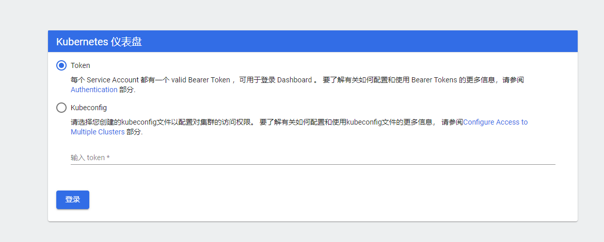
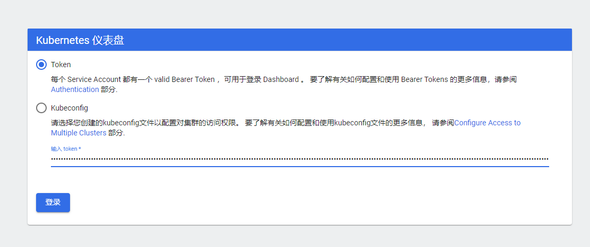
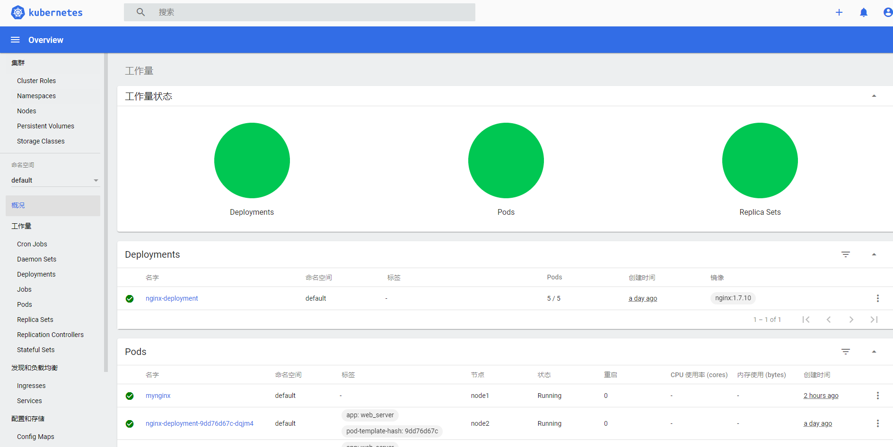
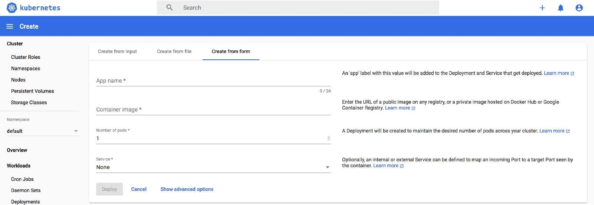
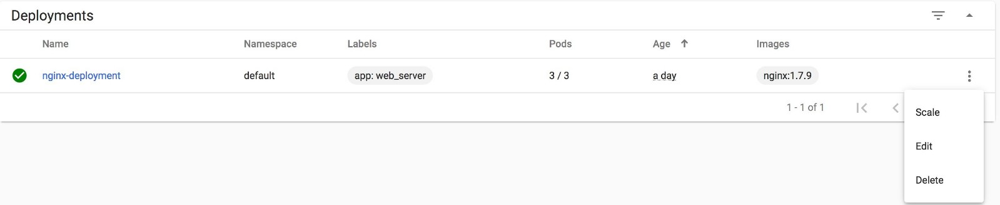
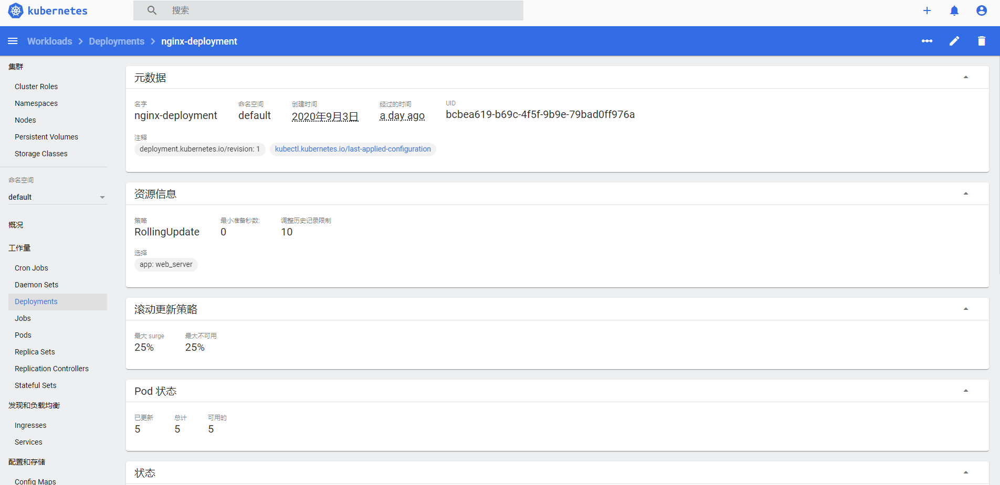
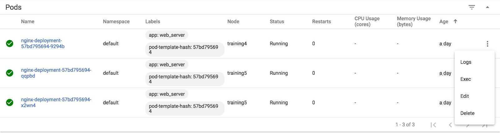

## Dashboard安装部署
> Dashboard因为没有在Kubernetes中直接默认安装，所以需要进行下载部署。推荐的方式就是采用容器化的方式作为应用部署到Kubernetes平台中。
> 具体安装过程可以参见[官网](https://kubernetes.io/docs/tasks/access-application-cluster/web-ui-dashboard/)

### 安装
> 1. 首先调用dashboard的yaml文件建立namespace、serviceaccount、service、configmap、secret、role、binding和deployment等
```
[root@master mnt]#  kubectl apply -f https://raw.githubusercontent.com/kubernetes/dashboard/v2.0.0/aio/deploy/recommended.yaml
namespace/kubernetes-dashboard created
serviceaccount/kubernetes-dashboard created
service/kubernetes-dashboard created
secret/kubernetes-dashboard-certs created
secret/kubernetes-dashboard-csrf created
secret/kubernetes-dashboard-key-holder created
configmap/kubernetes-dashboard-settings created
role.rbac.authorization.k8s.io/kubernetes-dashboard created
clusterrole.rbac.authorization.k8s.io/kubernetes-dashboard created
rolebinding.rbac.authorization.k8s.io/kubernetes-dashboard created
clusterrolebinding.rbac.authorization.k8s.io/kubernetes-dashboard created
deployment.apps/kubernetes-dashboard created
service/dashboard-metrics-scraper created
deployment.apps/dashboard-metrics-scraper created
```
> 2. 修改dashboard的service，使其使用NodePort模式
```
[root@master mnt]#  kubectl  edit service kubernetes-dashboard --namespace=kubernetes-dashboard
将默认的type: ClusterIP改成type: NodePort模式
```
> 3. 查询service在服务器上分配的物理端口
```
[root@master mnt]# kubectl get service -n kubernetes-dashboard
NAME                        TYPE        CLUSTER-IP       EXTERNAL-IP   PORT(S)         AGE
dashboard-metrics-scraper   ClusterIP   10.107.167.246   <none>        8000/TCP        4m10s
kubernetes-dashboard        NodePort    10.97.9.221      <none>        443:32237/TCP   4m10s
```
> 上面443:32237就表示对应的ClusterIP端口为443，Node节点的端口为32237.

### 访问
1. 对于服务器可以直接采用其公网端口的32237来进行Dashboard的Web访问：`https://public_ip:32237`
2. 第一次登陆会触发登陆权限控制,建议选用Token模式完成用户验证。
   
3. 先创建配置用于建立集群管理员账户 `vi mydashboard.yaml`
```
apiVersion: v1
kind: ServiceAccount
metadata:
  name: admin-user
  namespace: kubernetes-dashboard
---
apiVersion: rbac.authorization.k8s.io/v1
kind: ClusterRoleBinding
metadata:
  name: admin-user
roleRef:
  apiGroup: rbac.authorization.k8s.io
  kind: ClusterRole
  name: cluster-admin
subjects:
- kind: ServiceAccount
  name: admin-user
  namespace: kubernetes-dashboard 
```
> 操作获取token,并赋予其cluster-admin权限
```
[root@master mnt]# kubectl apply  -f mydashboard.yaml 
serviceaccount/admin-user created
clusterrolebinding.rbac.authorization.k8s.io/admin-user created
[root@master mnt]#  kubectl -n kubernetes-dashboard describe secret $(kubectl -n kubernetes-dashboard get secret | grep admin-user | awk '{print $1}')
Name:         admin-user-token-7gjhz
Namespace:    kubernetes-dashboard
Labels:       <none>
Annotations:  kubernetes.io/service-account.name: admin-user
              kubernetes.io/service-account.uid: 0f554a3f-99bd-477d-bb87-d72377be61d3

Type:  kubernetes.io/service-account-token

Data
====
namespace:  20 bytes
token:      eyJhbGciOiJSUzI1NiIsImtpZCI6ImpVTHhzTXpEbEx2Wlp4Z2VYUDQtbFUzRFludmQ0ZGZtY0dEaWlwdDZOdGMifQ.eyJpc3MiOiJrdWJlcm5ldGVzL3NlcnZpY2VhY2NvdW50Iiwia3ViZXJuZXRlcy5pby9zZXJ2aWNlYWNjb3VudC9uYW1lc3BhY2UiOiJrdWJlcm5ldGVzLWRhc2hib2FyZCIsImt1YmVybmV0ZXMuaW8vc2VydmljZWFjY291bnQvc2VjcmV0Lm5hbWUiOiJhZG1pbi11c2VyLXRva2VuLTdnamh6Iiwia3ViZXJuZXRlcy5pby9zZXJ2aWNlYWNjb3VudC9zZXJ2aWNlLWFjY291bnQubmFtZSI6ImFkbWluLXVzZXIiLCJrdWJlcm5ldGVzLmlvL3NlcnZpY2VhY2NvdW50L3NlcnZpY2UtYWNjb3VudC51aWQiOiIwZjU1NGEzZi05OWJkLTQ3N2QtYmI4Ny1kNzIzNzdiZTYxZDMiLCJzdWIiOiJzeXN0ZW06c2VydmljZWFjY291bnQ6a3ViZXJuZXRlcy1kYXNoYm9hcmQ6YWRtaW4tdXNlciJ9.EOVnkjt8NsP9eMUCuZ1VJ6M_BEpnnhJXx4UTEyWbAuzXEvJ9fCd2tH9-HNslfamPfYEWc886S_IPuJ08WD_QnVqC5CxeqXZRvbENOjPjkYQY54xUk_yLPO2N7I18rwnc08zPeII1tv8TIeZBk2RQa8wLX26Z82DdNbqdiUag9xJUsBSIoRjHr5fr4xwPm3TZoakyya_9Bowc85OAf0AQmt4oC_anBRxktBDA0hTXqNE8gneGTa_Rcg9JA01m_OBYqIg1a5l11uVr9HpdshN8zcHdGZMCwB3daCdLP1zakTE5kw_1R_uXcOIWBTvrqI7hxM2cBkfi7D2mPofUcgnypQ
ca.crt:     1066 bytes
```
4. 将上图中的token值输入Dashboard图形化界面
   
   顺利进入了Dashboard！
   

### 日常操作

1. 部署Deployment
   单击顶部操作区的+Create按钮就可以创建Deployment等控制器了。可以选择`Create from form`分页来进行容器镜像的指定，也可以选择`Create from input`从YAML或JSON文件来创建deployment。
   
2. 在线修改
   点击具体的控制器，可以选择`Edit`进行YAML文件的修改。修改完保存后，Dashboard会自动Apply这个变更，从而是修改后的功能立刻生效。
   
   
3. 信息查询
   类似于`Kuberctl describe`，当点击具体的控制器后，可以看到该控制器的主要配置和状态。
   
4. 日志查询
   点击某一个POD，可以在右侧的选项栏选择logs，效果和`kubernetes logs`类似。
   
5. 其他监控
   在Dashboard主界面可以通过切换namespace查询更多的配置和状态信息。