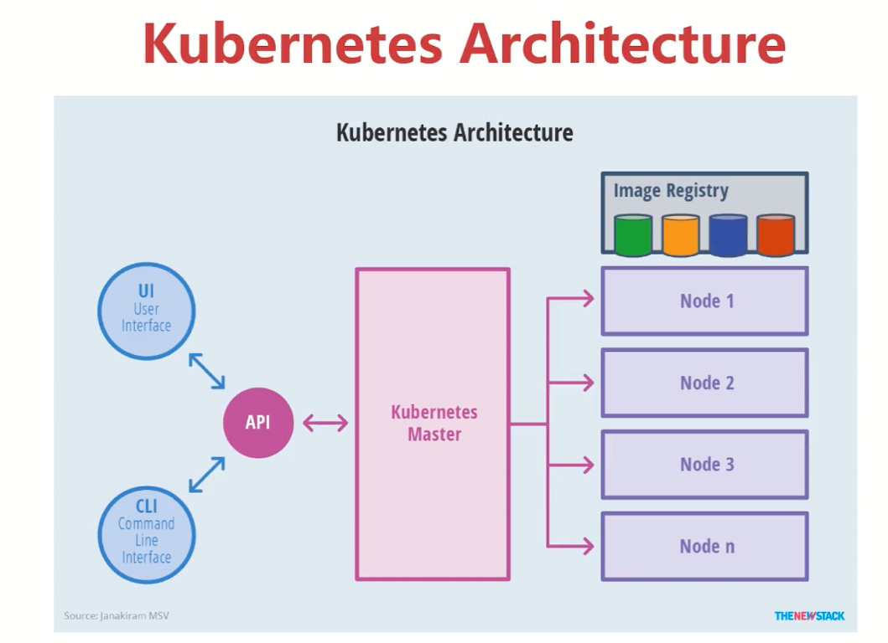
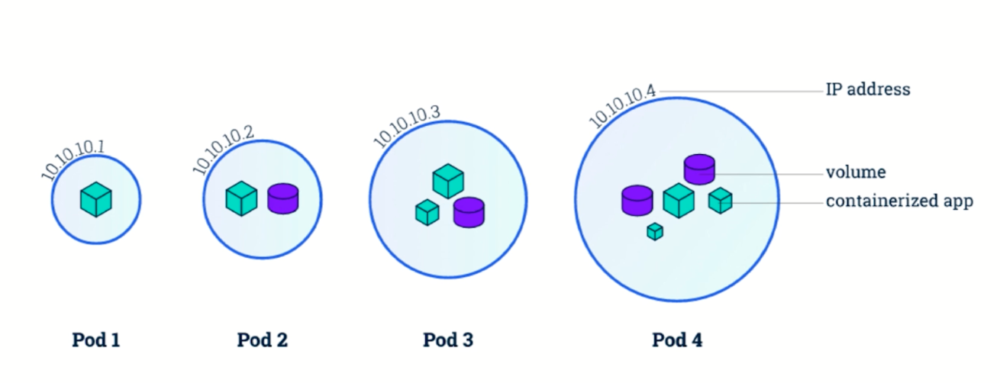
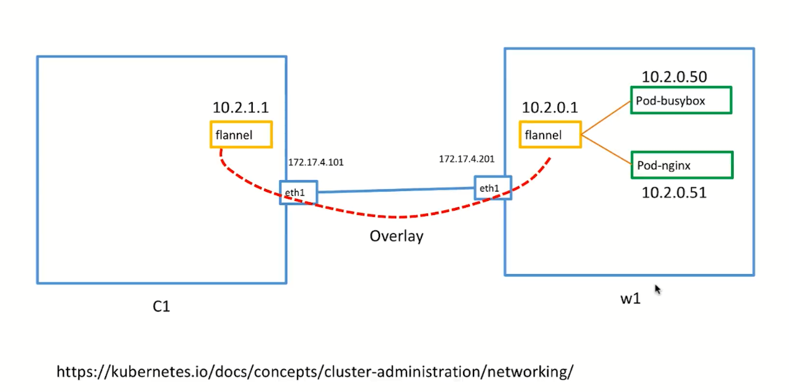

## 安装
```
docker swarm leave         # 如果安装了swarm，需要先删除和退出
```
## Kubenetes
[中文网](https://www.kubernetes.org.cn)
### Kubenetes 简介

###  搭建k8s环境
+ 1.hard way方式搭建，比较困难，代码[k8s kelseyhightower](https://github.com/kelseyhightower/kubernetes-the-hard-way)
+ 2.[k8s Minikube](https://github.com/kubernetes/minikube)快速搭建K8S单节点环境，适合学习
+ 3.[k8s kubeadm](https://github.com/kubernetes/kubeadm)快速搭建k8s多节点环境
+ 4.[k8s kops](https://github.com/kubernetes/kops)快速在cloud搭建k8s环境
+ 5.[coreos tectonic](https://coreos.com/tectonic/)>> 搭建k8s环境，少于10个点击免费，超过收费
+ 6.[play-with-k8s](https://labs.play-with-k8s.com/)
#### Minikube
+ install
+ 创建k8s单节点
```
minikube start
kubectl config view                        # 查看当前上下的信息
kubectl config get-contexts                # 获取集群的context
kubectl cluster-info                       # 类似docker node
minikube ssh                               # 进入virtualbox 虚拟机
docker version
```
##### K8S最小调度单位Pod

```
$ kubectl get pods   # 获取所有正在运行的POD
$ kubectl get pods -o wide   # 获取pod的更多信息，比如在哪台k8s机器上
$ kubectl describe pod <pod>   #获取一个POD的详细信息
$ kubectl exec <pod> <cmd>     #在pod里的container里执行一个命令，如果这个pod有多个container，默认会在第一个里执行，或者通过-c去指定哪个
```
```
cd docker\labs\07-docker-kubernetes\pod-basic
pcat pod_nginx.yml
kubectl version                            # 看看当前的k8s是否生效
kubectl create -f  pod_nginx.yml           # 创建pod
kubectl delete -f pod_nginx.yml            # 删除pod
kubectl create -f  pod_nginx.yml           # 创建pod
kubectl get pods                           # 获取所有创建的pod
kubectl get pods -o wide                   # 获取容器信息
如何进入容器呢？
minikube ssh
docker ps
docker exec -it 容器id sh                   # 进入容器内部
此时ip a 或者ifconfig 命令执行不了
exit
docker network ls
docker network inspect bridge
exit   # 退出minikube host
kubectl get pods -o wide
kubectl exec -it nginx sh                  # 进入pod内部，如果有多个container，默认进入的是第一个
kubectl exec -h                            # 看一下帮助，可以通过-c，指定进入那个容器
kubectl exec -it nginx -c 容器名字 sh
kubectl describe  pod                      # 查看某个resource
kubectl describe  pod  nginx               # 查看nginx pod的resource信息
minikube ssh                     在minicube host是可以访问nginx服务的
ping 172.17.0.4  
crul 172.17.0.4 
exit
kubectl port-forward nginx 8080:80     # 做一个端口映射，把容器的80端口映射到minikube的8080端口,此时有问题，如果ctrl+c，就会失效，如果实现后台运行呢？
浏览器访问： http://127.0.0.1:8080
```
##### ReplicaSet和ReplicationController
[ReplicaSet](https://kubernetes.io/docs/concepts/workloads/controllers/replicaset/)
```
kubectl delete -f pod_nginx.yml            # 删除pod
cd chapter9\labs\replicas-set
kubectl create -f rs_nginx.yml             # 此时会报错，在v1版本不支持ReplicaSet，可以使用ReplicationController
kubectl create -f rc_nginx.yml               
kubectl get rc                             # 查询rc
kubectl get pods                           # 查询pods，发现此时有3个pods
做一个实验：删除一个pod
kubectl delete pods pod的名称
kubectl get pods                          # 发现一个删除，一个在创建
如何扩展呢？
kubectl scale rc nginx --replicas=2       # 减少到2个 
kubectl get pods 
kubectl get rc 
kubectl scale rc nginx --replicas=4       # 扩展到4个
kubectl get rc
kubectl get pods
kubectl get pods -o wide                  # 看一下容器信息
kubectl delete -f rc_nginx.yml  
kubectl get pods -o wide
把rs_nginx.yml 文件中的版本从v1修改成apps/v1
kubectl create -f rs_nginx.yml 
kubectl get rs
kubectl get pods 
kubectl scale rs nginx --replicas=2
kubectl get rs
```
##### Deployment
[deployment](https://kubernetes.io/docs/concepts/workloads/controllers/deployment/)
```
cd chapter9\labs\deployment
kubectl create -f deployment_nginx.yml
kubectl get deployment 
kubectl get rs 
kubectl get pods 
kubectl get deployment -o wide    # 显示deployment更多的信息
kubectl set image deployment nginx-deployment nginx=nginx:1.13
kubectl get deployment -o wide     此时变成了1.13
kubectl get rs                  # 发现旧的被删除，新的在创建
kubectl get pods 
kubectl rollout history deployment nginx-deployment 
kubectl rollout undo deployment nginx-deployment    # 回滚到上一个版本
kubectl get deployment -o wide     此时变成了1.12.2
kubectl set image deployment nginx-deployment nginx=nginx:1.13
kubectl get node  
kubectl get node -o wide    
如何把内部的nginx的端口暴露到外部的host呢
kubectl expose deployment nginx-deployment --type=NodePort
#kubectl delete services nginx-deployment  
kubectl get svc                    # 查询service信息
curl http://minicubehostip:刚才暴露的端口
```
#### 使用Tectonic在本地搭建多节点K8S集群
[coreos](https://coreos.com/tectonic/docs/latest/tutorials/)
[config合并参考](https://kubernetes.io/docs/tasks/access-application-cluster/configure-access-multiple-clusters/)

```
cd chapter9\tectonic-sandbox-1.7.5-tectonic.1
vagrant up
这样本地有两个cluster，一个minicube，一个tectonic，需要将两个配置文件合并,文件路径 ~/.kube/config
参考https://kubernetes.io/docs/tasks/access-application-cluster/configure-access-multiple-clusters/
kubectl config get-contexts             查看当前系统的上下文变量
kubectl config use-context minikube     切换cluster到minikube
kubectl get node
kubectl config use-context tectonic
kubectl get node                  发现此时有两个节点
vagrant ssh c1           进入其他一台名叫c1的节点，不是centos，也不是ubuntu，而是一个Container linux by coreos
docker version
docker ps
```
##### k8s基础网络Cluster Network
```
vargrant status
cd chapter9\labs\services
kubectl create -f  pod_busybox.yml
kubectl create -f  pod_nginx.yml
kubectl get pods
kubectl get pods -o wide
kubectl exec -it busybox-pod sh   进入busybox-pod的sh
ip a
ping ngnixpod对应的ip，例如10.2.0.51    发现可以ping通，为什么能ping通呢？
vagrant c1    到c1机器,发现也能ping这两台机器
ping 10.2.0.50
ping 10.2.0.51
ifconfig   我们会发现一个flannel的端口，同样在w1也有
vargrant w1    到w1机器,发现也能ping这两台机器
ping 10.2.0.50
ping 10.2.0.51
结论：在pod中可以ping所有pod的ip地址，在k8s的节点也能ping通所有pod的ip地址,多机器和单机器都可以访问
在之前docker中我们两个不同的机器使用的是overlay的网络
```

[k8s network](https://kubernetes.io/docs/concepts/cluster-administration/networking/)

#### Service
##### 不要直接使用和管理pods，为什么？
+ 当我们使用ReplicaSet 或者 ReplicationController 做水平扩展scale的时候，Pods有可能会被terminated
+ 当我们使用Deployment的时候，我们去更新Docker Image Version，旧的Pods会被Termindated，然后新的Pods创建
##### service
+ kubectl expose命令，会给我们的pod创建一个Service，供外部访问
+ Service主要有三种类型，一种叫ClusterIP,一种叫NodePort,一种叫外部的LoadBalancer
+ 另外也可以使用DNS，但是需要DNS的add-on

##### clusterIP,cluster内部可以访问，外部访问不了
[rolling-update](https://kubernetes.io/docs/tasks/run-application/rolling-update-replication-controller/)
``` 还是基于coreos  Tectonic的实验环境
cd chapter9\labs\services
kubectl create -f  pod_busybox.yml
kubectl create -f  pod_nginx.yml
kubectl get pods -o wide
kubectl expose  pods nginx-pod    #创建一个clusterIp，只能cluster内部访问 
kubectl get svc 
vagrant ssh c1
curl 访问刚才创建的clusterIp，例如10.3.248.3
演示pod ip变化，但是service ip不会影响
kubectl create -f deployment_python_http.yml
kubectl get pods -o wide 
vagrant ssh c1
curl pod的ip，例如10.2.0.142:8080   可以访问
curl 10.2.0.141:8080
exit
kubectl get deployment    获取名字是service-test
kubectl expose deployment  service-test   创建一个名叫service-test的deployment类型的服务
kubectl get svc
vagrant ssh c1
curl 服务的ip，例如：10.3.120.168：8080 
curl 服务的ip，例如：10.3.120.168：8080
curl 服务的ip，例如：10.3.120.168：8080    3次访问serviceip返回的结果不一样，使用内部做了负载均衡
做一个实验，在c1上执行while true; do curl  10.3.120.168：8080; done
开启另外一个shell，更新服务，看看c1访问是否中断
kubectl edit deployment service-test    打开yml文件，更新文件，实现文件的更新,这种更新会有部分中断，没有rolling update，参考： https://kubernetes.io/docs/tasks/run-application/rolling-update-replication-controller/
kubectl get pods 
```
##### NodePort,绑定到一个cluster中的每一个node，可以node的ip和service的端口对外提供访问的
+ nodePort 暴露的端口范围有限制
+ nodeport 暴露的端口在cluster中的所有的node上，端口的浪费
+ 实际环境用的少
```
cd chapter9\labs\services
kubectl create -f  pod_nginx.yml
kubectl get pods 
kubectl expose pods nginx-pod --type=NodePort
kubectl get svc    可以通过serviceip和端口直接可以访问,端口31404
kubectl get node -o wide    没有显示ip地址
kubectl describe node xxnodenamexxx  查找这个node的ip地址，例如： 172.17.4.101
通过浏览器访问： http://172.17.4.101:31404
kubectl delete service nginx-pod
kubectl get svc
kubectl get pods
通过yml文件创建一个service
kubectl get pods --show-labels  看一下pods的label信息
kubectl create -f service-nginx.yml
kubectl get svc
通过浏览器访问： http://172.17.4.101:32333
```
##### Label使用
```
cd chapter9\labs\services 
kubectl create -f  pod_busybox.yml
kubectl get pods     #此时显示pending
kubectl get node --show-lables    我们发现在node上没有一个hardware good的label存在，所以pod会一直pending
kubectl get nodes  获取所有的node名称，例如w1.technoicssandbox.com
kubectl label node w1.technoicssandbox.com hardware=good
kubectl get node --show-labels   看一下节点的hardware是否设置上
kubectl get pods    需要过一段时间看一下，此时不是pending了，而是running
```
##### LoadBalancer，需要云服务商提供
##### kops install
[k8s kops](https://github.com/kubernetes/kops)快速在cloud搭建k8s环境

##### 使用kops在亚马逊AWS上搭建k8s集群
```
vi pod_nginx.yml  创建一个nginx的pod，参考chapter9\labs\services\pod_nginx.yml
kubectl create -f pod_nginx.yml
kubectl get pods -o wide ,例如pod的ip为： 100.96.1.3
ssh -i ~/.ssh/id_rsa admin@api.k8s.imooc.link     master的一个dns地址api.k8s.imooc.link
ping 100.96.1.3   可以ping通
curl 100.96.1.3   访问到了nginx配置
exit
kubectl get pods
kubectl expose pod nginx-pod --type=NodePort   创建一个NodePort类型的service
kubectl get svc    映射到了31235端口
curl api.k8s.imooc.link:31235   访问master节点，没有返回，需要在aws的防火墙设置一下这个端口才可以访问
http://api.k8s.imooc.link:31235
```
#####  LoadBlancer类型Service以及AWS的DNS服务配置
```
kubectl get pods
kubectl get svc
kubectl delete service nginx-pod       删除上次的service
kubectl expose pod nginx-pod --type=LoadBalancer   创建一个LoadBalancer的service,此时会在aws上创建LoadBalance
kubectl get svc   
进入到aws的ec2 dashboard可以看一下，这样我们就可以直接通过dns在浏览器访问我们的nginx pod，当然我们也可以通过master的ip+ 端口配置的方式进行访问
自动生成的dns比较难记住，我们可以给设置一个recordset，给设置一个别名，例如nginx.k8s.imooc.link,选择刚才创建的load balance的dns
配置太繁琐，可以看看external-dns（https://github.com/kubernetes-incubator/external-dns）
```
[external-dns](https://github.com/kubernetes-incubator/external-dns)

##### 实战： 在亚马逊k8s集群上部署wordpress
```
cd chapter9\labs\wordpress
kubectl create secret generic mysql-pass --from-literal=password=imooc  创建一个secret
kubectl get secret 
kubectl create -f  mysql-deployment.yaml
kubectl get svc 
kubectl get deployment 
kubectl get pods
kubectl create -f wordpress-deployment.yaml
kubectl get svc 
kubectl get deployment 
kubectl get pods
aws中的ec2的dashboard中可以查看loadbalance，通过dns在浏览器直接可以访问
kubectl exec -it 容器id bash ，进入到容器里面测试一下wordpress链接db
ping mysql-service   可以通过service互相访问
```
## 容器的运维和监控
### 容器的基本监控
```
cd chapter10\
vagrant up
vagrant status
vagrant ssh docker-host-10
docker ps -a
docker top  容器id
docker stats   输入q退出
```
+ weavescope 监控，可视化和管理Docker，K8s
```
sudo curl -L git.io/scope -o /usr/local/bin/scope
sudo chmod +x /usr/local/bin/scope
scope launch 192.168.210.10  
会提供一个访问界面的url，例如：http://192.168.210.10:4040/
```
+ weavescope 监控多台主机
```
在多台主机分别执行下面的命令即可
scope launch 192.168.210.10  192.168.210.11
```
+ wordpress实战
```
cd cd chapter10\labs\wordpress
curl -L https://github.com/docker/compose/releases
sudo chmod +x /usr/local/bin/docker-compose
docker-compose  up
```
### k8s集群运行资源监控——Heapster+Grafana+InfluxDB
#### Heapster
[Heapster](https://github.com/kubernetes/heapster) Compute Resource Usage Analysis and Monitoring of Container Clusters
[Cluster add-on](https://github.com/kubernetes/kubernetes/tree/master/cluster/addons)
```
1.首先要准备一个k8s的集群
2.安装Heapster
minikube ssh
docker pull k8s.gcr.io/heapster-grafana-amd64:v4.4.3
docker pull k8s.gcr.io/heapster-amd64:v1.4.2
docker pull k8s.gcr.io/heapster-influxdb-amd64:v1.3.3
exit
cd chapter10\labs\heapster-master\deploy\kube-config\influxdb\
kubectl create -f influxdb.yaml
kubectl create -f heapster.yaml
kubectl create -f grafana.yaml
source <(kubectl completion zsh)
kubectl get deployment  发现没有，是因为在不同的namespace
kubectl get svc
kubectl get namespace
kubectl get svc  --namespace kube-system    在kube-system中查找service
发现有个kubernetes的dashboard
http://【minicube的主机ip】:30000   访问dashboard
http://【minicube的主机ip】:30619   访问 grafana  需要登陆，默认的用户名和密码是 admin/admin
kubectl get pods
kubectl expose pods nginx-pod --type=NodePort
kubectl get svc   看一下nginx 的端口32260
wrk -t12 -c400 -d30s  http://【minicube的主机ip】:32260      访问nginx做一个测试
```
#### 根据资源占用自动横向伸缩
通过上节的性能监控，我们可以进行资源的占用自动横向伸缩
[horizontal-pod-autoscale](https://kubernetes.io/docs/tasks/run-application/horizontal-pod-autoscale/)

```
cd chapter10\labs\heapster-master\deploy\kube-config\influxdb\
kubectl delete 
minikube addons list 
minikube addons enable heapster   开启heapster
minikube start --extra-config=controller-manager.HorizontalPodAutoscalerUseRESTClients=false
开始实验(https://kubernetes.io/docs/tasks/run-application/horizontal-pod-autoscale-walkthrough/)
只要资源占用在50%的情况，就会扩展，最大扩展到10个
### 创建一个pod
kubectl run php-apache --image=k8s.gcr.io/hpa-example --requests=cpu=200m --expose --port=80
### 创建autoscale
kubectl autoscale deployment php-apache --cpu-percent=50 --min=1 --max=10 
kubectl get deployment php-apache
kubectl get horizontalpodautoscaler
kubectl get svc    此时php-apache的ip为： 10.105.138.235
minikube ssh 进入到minikube
wget php-apache的服务ip[10.105.138.235]:80 
rm -rf index.html
重新开启一个shell，写一个循环
while true; do wget -q -O- http://10.105.138.235;done
返回在minicube 主机。
kubectl get horizontalpodautoscaler   查看资源的情况
kubectl get deployment php-apache     此时已经扩展
把开启的shell的循环结束，看看是否scale降低
```
#### k8s集群Log的采集和展示——ELK+Fluentd
##### 容器时代的log
+ logging是我们了解应用运行状态非常重要的手段，它可以显示error，info甚至debug信息
+ 容器时代，我们怎么看log？ docker logs,kubectl logs
##### solution
+ 30多年历史的Syslog
+ 新时代的log技术
	+ ELK Stack(ElasticSearch + LogStash + Kibana)  需要再学习学习？？？
	+ Hosted log 服务
+ 工具介绍
	+ Fluentd（log转发）
	+ ElasticSearch(log Index)
	+ Kibana (log可视化）
	+ LogTrail（log UI查看）

```
1. 先准备一个实验环境，在aws使用kops开了一个3个node的cluster
2. 或者使用[k8s kubeadm](https://github.com/kubernetes/kubeadm)在本地快速搭建k8s多节点环境
cd chapter10\labs\logging\
kubectl get node
kubectl lable node --all beta.kubernetes.io/fluentd-ds-ready=true 给所有的节点打一个标签，为了fluentd的安装和收集log
cd ..
kubectl create -f logging/   会把logging中的yml定义的资源文件都会创建
kubectl get svc --namespace=kube-system     获取kube-system namespace中的service
通过loadbalance地址和端口进行浏览器访问
```
#### k8s集群监控方案Prometheus
[Prometheus](https://prometheus.io/)
```
1. 先准备一个实验环境，在aws使用kops开了一个3个node的cluster
kubectl get node 
cd chapter10\labs\prometheus\
通过loadbalance的url和端口访问
kubectl get svc 
kubectl get pod -o wide 
kubectl get nod -o wide
ssh admin@awsmasterip的节点
curl http://pod的ip/metrics    可以根据情况自己采集数据
```