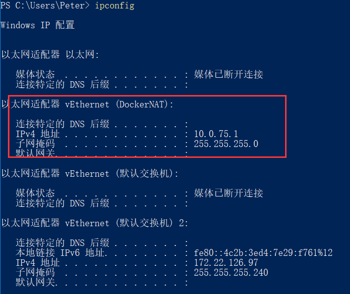
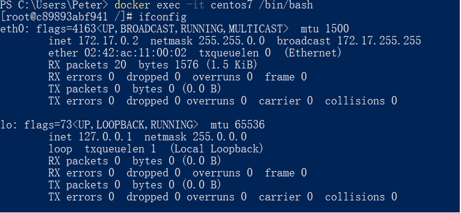
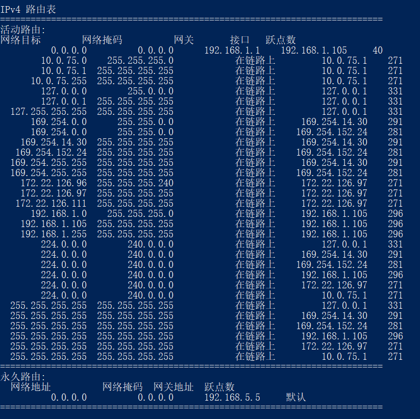
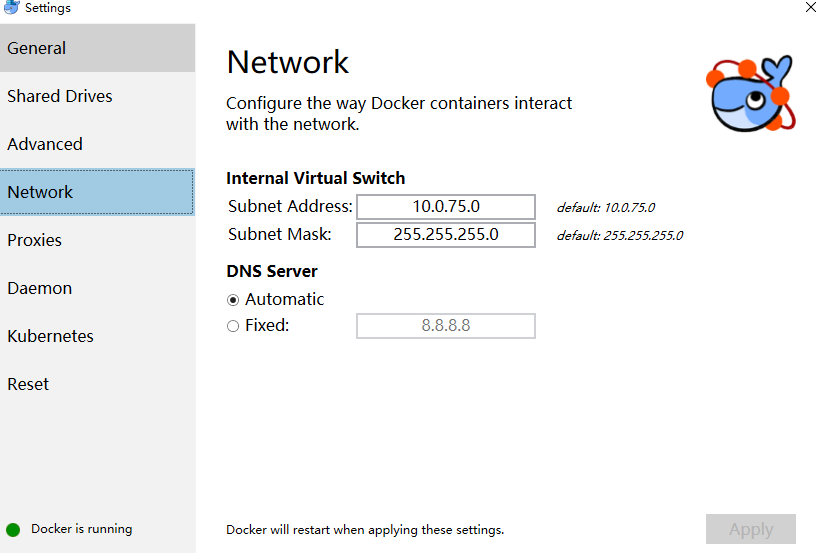
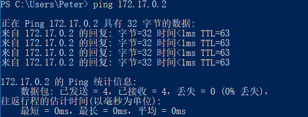

## 开启Centos7
```
docker pull centos
docker run -itd -p 44077:22 --name centos7 --privileged=true  centos  /usr/sbin/init
docker ps 
docker exec -it centos7 /bin/bash
yum install initscripts   -y                        # 可以使用ip a 和service命令
yum -y install net-tools                          # ifconfig
netstat -antp | grep sshd                        # 查看是否启动22端口
yum install openssh-server -y                 # install ssh service
service sshd start                                    
ssh -p 44077 root@宿主机ip          # 通过宿主机ip登录centos7，本地直接用127.0.0.1
docker start 容器id或者名称
docker logs 容器id或者名称
```

## win10 docker for windows 容器内网通过独立IP直接访问的方法
### 默认情况下
+ Docker的默认启动方式中，会产生一块虚拟网卡，然后容器内自行分配单独的网卡和IP。可以在宿宿主机上通过ipconfig命令看到这个虚拟网卡

+ 打开一个容器，可以看到容器ip地址为自动分配的
```
docker exec -it centos7 /bin/bash
```

+ 通过宿主机无法ping通

### 配置宿主机的路由实现互通
+ 查看宿主机路由，`route print`
  
+ 查看docker 的ip地址

+ 暴露给宿主机的为10.0.75.1,宿主机添加路由
`route -p add 172.17.0.0 MASK 255.255.255.0 10.0.75.2`
> 删除路由 `route delete  172.17.0.0 MASK 255.255.255.0 10.0.75.2`
+ 重新ping容器地址,现在则可以直接通过ip访问
