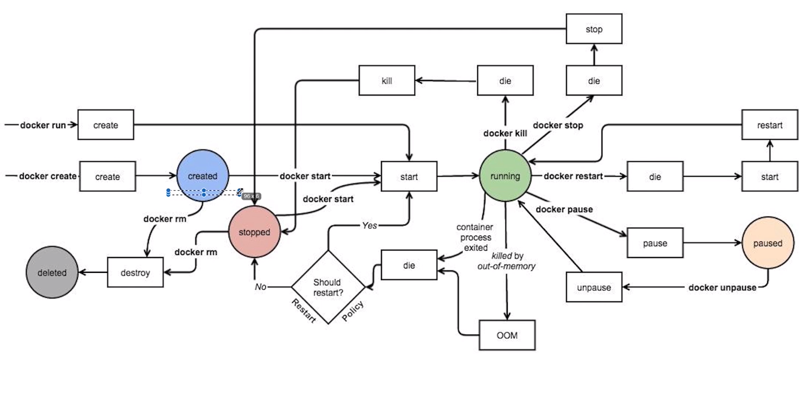

## docker 环境搭建
```
curl -fsSL get.docker.com -o get-docker.sh
sh get-docker.sh --mirror Aliyun
systemctl daemon-reload
systemctl restart docker
docker version
```

## docker 生命周期管理


### docker create 
```
# create  - start  等同于docker run
docker pull nginx
docker creat nginx
docker start 容器id
docker exec -it 容器id /bin/bash
```
### docker pause
```
# pause
docker pause 容器id                          # 暂停容器，进入paused状态
docker exec -it 容器id /bin/bash             # 此时进入不了，因为已经pause了
docker unpause 容器id                        # 开启容器，进入running状态
docker exec -it 容器id /bin/bash             # 此时可以进入容器
```
### docker stop 
```
# stop
docker stop 容器id                           # 停止容器，进入die状态
docker ps -a
docker start 容器id                          # 启动容器，由die状态进入running状态
```
### docker kill 
```
# kill
docker kill 容器id
docker ps -a
docker start 容器id
```
### docker rm
```
# 删除
docker stop 容器id 
docker rm  容器id                            # 删除前必须先执行stop，或者强制删除
docker rm -f 容器id                          # 强制删除，等同于stop 然后 rm
```
### docker logs
```
docker logs 容器id
docker logs -f 容器id
```

## 资源限制
### cpu
```
docker run -d -c 4000 nginx                                 # 限制cpu，4000是一个相对值，当资源不充足的时候
docker run -d -c 40   nginx
```
### 内存
```
docker run -d -m 200M --memory-swap=400M nginx              # 200m内存，200m swap
```

### 磁盘
```
docker run -d -blkio-weight 300 nginx                     # 限制磁盘io，300是一个相对值
```