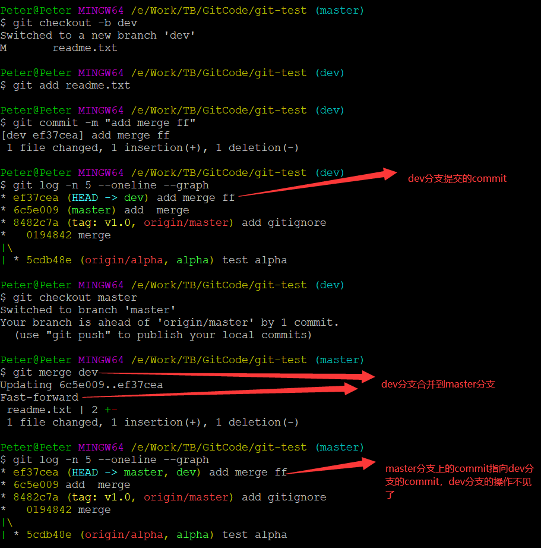
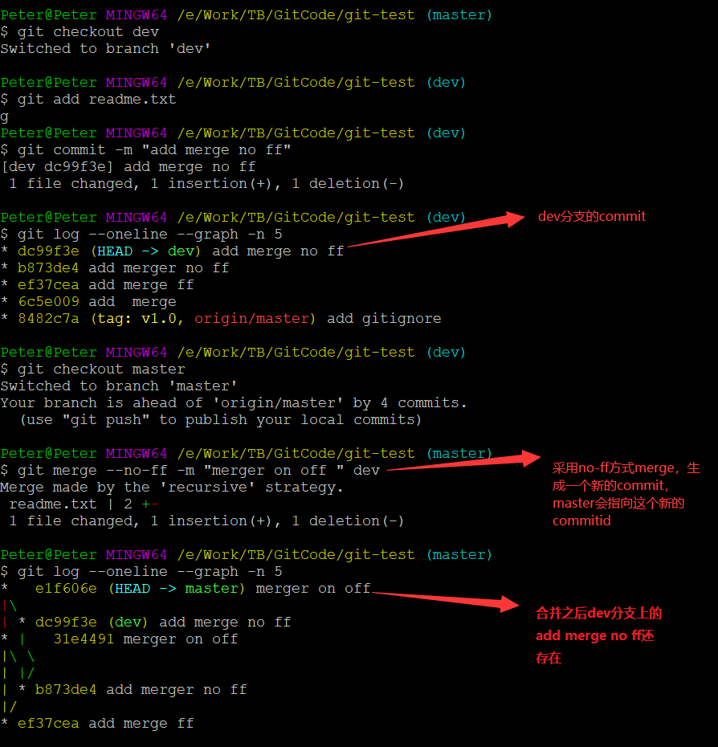

## 基本命令
```
git checkout -b dev
git add .
git commit -m "test dev"
git checkout master
git add . 
git commit -m "test master"
git merge dev
git log --oneline  --graph --all
```

### 添加多个远程仓库
> 因为git本身是分布式版本控制系统，可以同步到另外一个远程库，当然也可以同步到另外两个远程库
> 使用多个远程库时，我们要注意，git给远程库起的默认名称是origin，如果有多个远程库，我们需要用不同的名称来标识不同的远程库

```
# 1. 需要在本地的~/.ssh/config 添加配置信息
Host gitee.com
Hostname gitee.com
User git
IdentityFile	~/.ssh/git_pub_key
```
```
git remote rm origin                                                  # 删除远程分支origin
git remote rename origin github                                       # 重命名，把现在的origin名称重命名成新的github
git remote add github git@github.com:peter/learngit.git               # 远程库的名称叫github，不叫origin了
git remote add gitee git@gitee.com:peter/learngit.git                 # 远程库的名称叫gitee，不叫origin
git remote -v
git push github master                                                # 推送到GitHub
git push gitee master                                                 # 推送到Gitee, 这样一来，我们的本地库就可以同时与多个远程库互相同步
```

### gitignore文件
```
$ git add App.class
The following paths are ignored by one of your .gitignore files:
App.class
Use -f if you really want to add them.
$ git add -f App.class               # 如果你确实想添加该文件，可以用-f强制添加到Git
$ git check-ignore -v App.class      # 可以用git check-ignore命令检查,哪个规则写错了
.gitignore:3:*.class	App.class    # Git会告诉我们，.gitignore的第3行规则忽略了该文件
```
### git branch
> `HEAD`严格来说不是指向提交，而是指向`master`，`master`才是指向提交的，所以，`HEAD`指向的就是当前分支。
> 一开始的时候，`master`分支是一条线，Git用`master`指向最新的提交，再用`HEAD`指向`master`，就能确定当前分支，以及当前分支的提交点。
> 每次提交，master分支都会向前移动一步，这样，随着你不断提交，master分支的线也越来越长


> 当我们创建新的分支，例如`dev`时，Git新建了一个指针叫`dev`，指向`master`相同的提交，再把`HEAD`指向`dev`，就表示当前分支在`dev`上
> Git创建一个分支很快，因为除了增加一个dev指针，改改HEAD的指向，工作区的文件都没有任何变化
```
$ git checkout -b dev
# 等同于
$ git branch dev
$ git checkout dev
# 列出所有分支，当前分支前面会标一个*号
$ git branch
* dev
  master
# 对readme.txt做个修改，加上一行
Creating a new branch.
# 然后提交
$ git add readme.txt 
$ git commit -m "branch dev test"
# 切换到maser
git checkout master
切换回master分支后，再查看一个readme.txt文件，刚才添加的内容不见了！因为那个提交是在dev分支上，而master分支此刻的提交点并没有变
# 把dev分支的工作成果合并到master分支上
git merge dev
git branch -d dev
```


> 不过，从现在开始，对工作区的修改和提交就是针对dev分支了，比如新提交一次后，dev指针往前移动一步，而master指针不变


> 如果我们在dev上的工作完成了，就可以把dev合并到master上。Git怎么合并呢？最简单的方法，就是直接把master指向dev的当前提交，就完成了合并
> 所以Git合并分支也很快！就改改指针，工作区内容也不变！


> 合并完分支后，甚至可以删除dev分支。删除dev分支就是把dev指针给删掉，删掉后，我们就剩下了一条master分支


### git tag
> 在Git中打标签非常简单，首先，切换到需要打标签的分支上
```
git branch -a
git checkout master
git tag v1.0                                            #  master分支上打一个tag
git tag v0.9  f0ea5d8                                   #  master分支上指定的commitid打一个tag
git tag -a v1.0  -m "version 0.1 released"              #  创建带有说明的标签，用-a指定标签名，-m指定说明文字
git tag -a v1.0  -m "version 0.1 released"  c40be9e     #  在指定的c40be9e的commitid添加一个标签
git show v1.0                                           #  查看标签
git tag -d v0.9                                         #  删除标签v0.9,因为创建的标签都只存储在本地，不会自动推送到远程。所以，打错的标签可以在本地安全删除,如果要推送某个标签到远程，使用命令git push origin <tagname>
git push origin v1.0                                    # 把v1.0标签推送到远程分支
git push origin --tags                                  # 一次性推送全部尚未推送到远程的本地标签
```
> 如果标签已经推送到远程，要删除远程标签就麻烦一点，先从本地删除
> 然后从远程删除。删除命令也是push
```
git tag -d v0.9                                         # 
git push origin :refs/tags/v0.9                         # 
```

### log
```
git log --oneline --graph
git log --pretty=oneline --graph --abbrev-commit 
gitk --all
```


###  Fast forward（快进模式）和 no-ff 区别
> Fast forward（快进模式）,表示快进模式合并，即直接将当前分支指针指向要合并的分支
> 使用fast forward的缺点,一旦删除分支或者分支指针往前走，很难体现该处提交是合并自某个分支的。即：一旦dev1.0删除或者新提交commit，master的第三、四个commit很难知道是通过合并dev1.0的
> no-ff（非快进模式）如果禁用掉Fast-forward(快进模式)，就可以生成新的commit，从而避免了“一旦dev1.0删除或者新提交commit，master的第三、四个commit很难知道是通过合并dev1.0的

> 下图利用Fast-forward将dev合并到master 



> 下图没有使用Fast-forward模式 ，可以看出，使用no-ff后，会多生成一个commit 记录，并强制保留develop分支的开发记录（而fast-forward的话则是直接合并，看不出之前Branch的任何记录）
> --no-ff 指的是强行关闭fast-forward方式。--no-ff (no fast foward)，使得每一次的合并都创建一个新的commit记录，即要求git merge即使在fast forward条件下也要产生一个新的merge commit，用来避免丢失信息




### 撤销
```
git status
git checkout -- readme.txt                     # 当你改乱了工作区某个文件的内容，想直接丢弃工作区的修改时
git log 
git reflog                                     # 查看历史提交的commit
git reset --soft commitid                      # 回到指定commitid，保留工作区修改
git reset --hard commmitid                     # 回到指定commitid，不保留工作区修改
```


### 删除
```
git add readme.txt
git commit -m "readme.txt"
git rm readme.txt
git commit -m "remove readme.txt"
git checkout -- readme.txt             # 删错了，因为版本库里还有呢，所以可以很轻松地把误删的文件恢复到最新版本, 从来没有被添加到版本库就被删除的文件，是无法恢复的
```