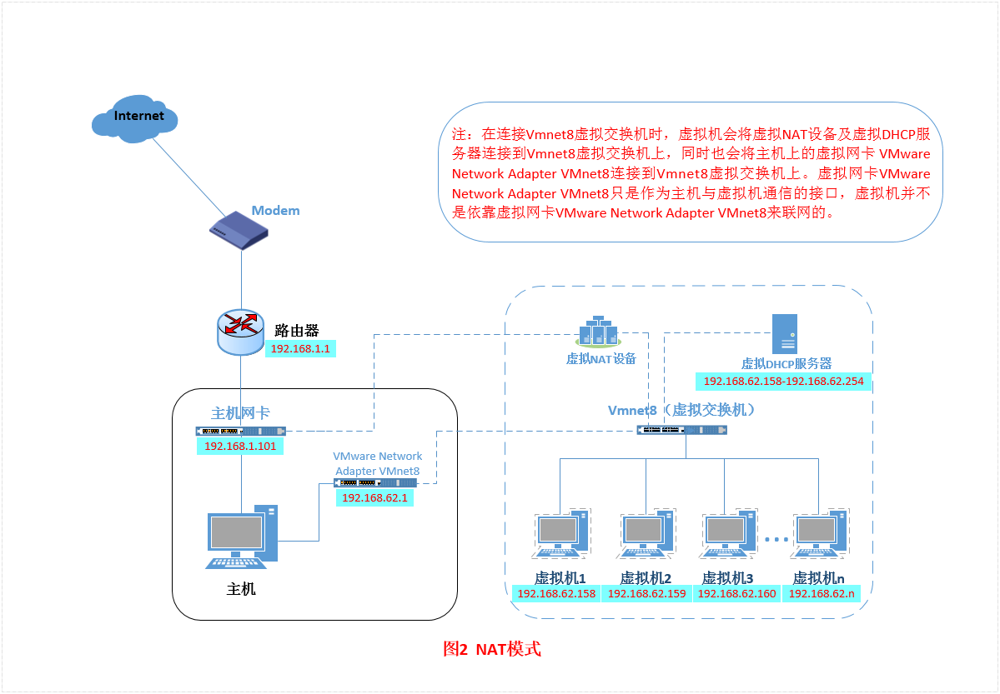
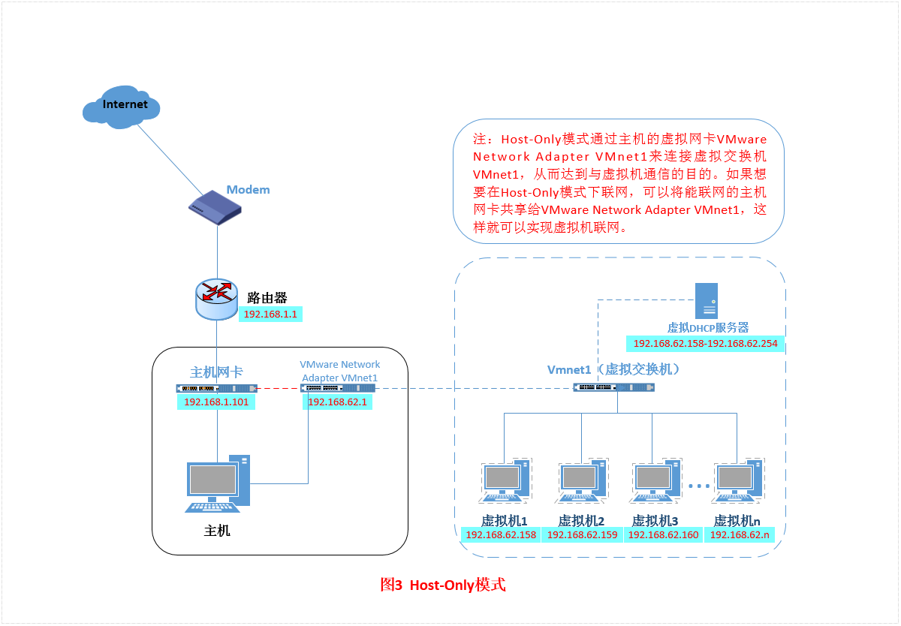

## vmware三种网络工作模式
+ 1.Bridged（桥接模式）
+ 2.NAT（网络地址转换模式）
+ 3.Host-Only（仅主机模式）
打开vmware虚拟机，我们可以在选项栏的“编辑”下的“虚拟网络编辑器”中看到VMnet0（桥接模式）、VMnet1（仅主机模式）、VMnet8（NAT模式），那么这些都是有什么作用呢？其实，我们现在看到的VMnet0表示的是用于桥接模式下的虚拟交换机；VMnet1表示的是用于仅主机模式下的虚拟交换机；VMnet8表示的是用于NAT模式下的虚拟交换机

同时，在主机上对应的有VMware Network Adapter VMnet1和VMware Network Adapter VMnet8两块虚拟网卡，它们分别作用于仅主机模式与NAT模式下。在“网络连接”中我们可以看到这两块虚拟网卡，如果将这两块卸载了，可以在vmware的“编辑”下的“虚拟网络编辑器”中点击“还原默认设置”，可重新将虚拟网卡还原

> 为什么在真机上没有VMware Network Adapter VMnet0虚拟网卡呢？

### 一、Bridged（桥接模式）
**桥接模式**就是将主机网卡与虚拟机虚拟的网卡利用虚拟网桥进行通信。在桥接的作用下，类似于把物理主机虚拟为一个交换机，所有桥接设置的虚拟机连接到这个交换机的一个接口上，物理主机也同样插在这个交换机当中，所以所有桥接下的网卡与网卡都是交换模式的，相互可以访问而不干扰。在桥接模式下，虚拟机ip地址需要与主机在同一个网段，如果需要联网，则网关与DNS需要与主机网卡一致。

接下来，我们就来实际操作，如何设置桥接模式
+ 装完系统之后，在开启系统之前，点击“编辑虚拟机设置”来设置网卡模式
  

+ 点击“网络适配器”，选择“桥接模式”，然后“确定”

+ 在进入系统之前，我们先确认一下主机的ip地址、网关、DNS等信息
  

+ 进入系统编辑网卡配置文件，命令为vi /etc/sysconfig/network-scripts/ifcfg-网卡
  

+ 添加内容如下

+ 编辑完成，保存退出，然后重启虚拟机网卡，使用ping命令ping外网ip，测试能否联网，能ping通外网ip，证明桥接模式设置成功。
那主机与虚拟机之间的通信是否正常呢？可以用远程工具来测试一下

+ 主机与虚拟机通信正常。
这就是桥接模式的设置步骤，相信大家应该学会了如何去设置桥接模式了。**桥接模式配置简单，但如果你的网络环境是ip资源很缺少或对ip管理比较严格的话，那桥接模式就不太适用了。如果真是这种情况的话，我们该如何解决呢？接下来，我们就来认识vmware的另一种网络模式：NAT模式**。

### 二、NAT（地址转换模式）
如果你的网络ip资源紧缺，但是你又希望你的虚拟机能够联网，这时候NAT模式是最好的选择。NAT模式借助虚拟NAT设备和虚拟DHCP服务器，使得虚拟机可以联网

在NAT模式中，主机网卡直接与虚拟NAT设备相连，然后虚拟NAT设备与虚拟DHCP服务器一起连接在虚拟交换机VMnet8上，这样就实现了虚拟机联网。那么我们会觉得很奇怪，为什么需要虚拟网卡VMware Network Adapter VMnet8呢？原来我们的VMware Network Adapter VMnet8虚拟网卡主要是为了实现主机与虚拟机之间的通信。在之后的设置步骤中，我们可以加以验证。
首先，设置虚拟机中NAT模式的选项，打开vmware，点击“编辑”下的“虚拟网络编辑器”，设置NAT参数及DHCP参数

+ 将虚拟机的网络连接模式修改成NAT模式，点击“编辑虚拟机设置

+ 开机启动系统，编辑网卡配置文件，命令为vi /etc/sysconfig/network-scripts/ifcfg-网卡

+ 编辑完成，保存退出，然后重启虚拟机网卡，动态获取ip地址，使用ping命令ping外网ip，测试能否联网，之前，我们说过VMware Network Adapter VMnet8虚拟网卡的作用，那我们现在就来测试一下。
将VMware Network Adapter VMnet8虚拟网卡禁用，然后，从虚拟机ping外网，看看是否能ping通？

在虚拟机内部ping www.baidu.com, 可以联网

如此看来，虚拟机能联通外网，确实不是通过VMware Network Adapter VMnet8虚拟网卡，那么为什么要有这块虚拟网卡呢？
之前我们就说VMware Network Adapter VMnet8的作用是主机与虚拟机之间的通信，接下来，我们就用远程连接工具来测试一下
然后，将VMware Network Adapter VMnet8启用之后，发现远程工具可以连接上虚拟机了。
那么，这就是NAT模式，利用虚拟的NAT设备以及虚拟DHCP服务器来使虚拟机连接外网，而VMware Network Adapter VMnet8虚拟网卡是用来与虚拟机通信的

### 三、Host-Only（仅主机模式）
Host-Only模式其实就是NAT模式去除了虚拟NAT设备，然后使用VMware Network Adapter VMnet1虚拟网卡连接VMnet1虚拟交换机来与虚拟机通信的，Host-Only模式将虚拟机与外网隔开，使得虚拟机成为一个独立的系统，只与主机相互通讯

+ 通过上图，我们可以发现，如果要使得虚拟机能联网，我们可以将主机网卡共享给VMware Network Adapter VMnet1网卡，从而达到虚拟机联网的目的。接下来，我们就来测试一下。
首先设置“虚拟网络编辑器”，可以设置DHCP的起始范围

+ 设置虚拟机为Host-Only模式

+ 开机启动系统，然后设置网卡文件

+ 保存退出，然后重启网卡，利用远程工具测试能否与主机通信

+ 主机与虚拟机之间可以通信，现在设置虚拟机联通外网

+ 我们可以看到上图有一个提示，强制将VMware Network Adapter VMnet1的ip设置成192.168.137.1，那么接下来，我们就要将虚拟机的DHCP的子网和起始地址进行修改，点击“虚拟网络编辑器

+ 重新配置网卡，将VMware Network Adapter VMnet1虚拟网卡作为虚拟机的路由

+ 重启网卡，然后通过 远程工具测试能否联通外网以及与主机通信

测试结果证明可以使得虚拟机连接外网
