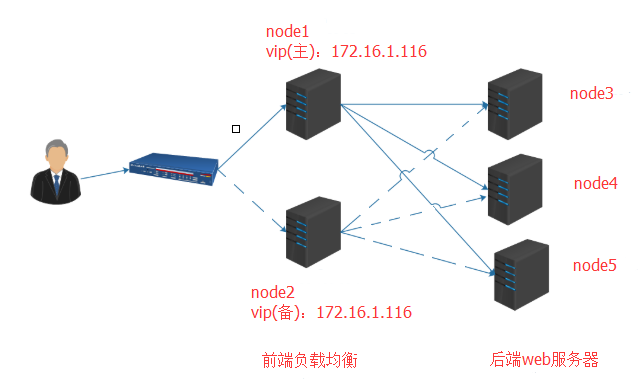

## 基于keepalived 实现主备，VIP转移
通过 Keepalived 工具来实现 nginx 的高可用（High Avaiability），达到一台nginx入口服务器宕机，另一台备机自动接管服务的效果
Keepalived是一个基于VRRP协议来实现的服务高可用方案，VRRP全称 Virtual Router Redundancy Protocol，即 虚拟路由冗余协议。可以认为它是实现路由器高可用的容错协议，即将N台提供相同功能的路由器组成一个路由器组(Router Group)，这个组里面有一个master和多个backup，但在外界看来就像一台一样，构成虚拟路由器，拥有一个虚拟IP（vip，也就是路由器所在局域网内其他机器的默认路由），占有这个IP的master实际负责ARP相应和转发IP数据包，组中的其它路由器作为备份的角色处于待命状态。master会发组播消息，当backup在超时时间内收不到vrrp包时就认为master宕掉了，这时就需要根据VRRP的优先级来选举一个backup当master，保证路由器的高可用
keepalived在一个节点上启动之后，会生成一个Master主进程，这个主进程又会生成两个子进程，分别是VRRP Stack（实现vrrp协议的） Checkers(检测ipvs后端realserver的健康状况检测)
VRRP双方节点都启动以后，要实现状态转换的，刚开始启动的时候，初始状态都是BACKUP，而后向其它节点发送通告，以及自己的优先级信息，谁的优先级高，就转换为MASTER，否则就还是BACKUP，这时候服务就在状态为MASTER的节点上启动，为用户提供服务，如果，该节点挂掉了，则转换为BACKUP，优先级降低，另一个节点转换为MASTER，优先级上升，服务就在此节点启动，VIP,VMAC都会被转移到这个节点上，为用户提供服务
这种方案，使用一个vip地址，前端使用2台机器，一台做主，一台做备，但同时只有一台机器工作，另一台备份机器在主机器不出现故障的时候，永远处于浪费状态，对于服务器不多的网站，该方案不经济实惠
+ 1.keepalived
+ 2.nginx
### 测试环境

+ 系统centos7.4 64位
+ 前端node1服务器:
  + node1:`172.16.1.114`
  + vip:`172.16.1.116`
+ 前端node2服务器:
  + node2:`172.16.1.115`
  + vip:`172.16.1.116`
+ 后端web服务器
  + node3: `172.16.1.117`
  + node4: `172.16.1.118`
  + node5: `172.16.1.119`

### 后端软件安装
+ 后端node3
```
yum -y install nginx
echo "this is 172.16.1.117" > /usr/share/nginx/html/index.html 
service nginx start
curl 172.16.1.117
this is 172.16.1.117
```
+ 后端node4
```
yum -y install nginx
echo "this is 172.16.1.118" > /usr/share/nginx/html/index.html 
service nginx start
curl 172.16.1.118
this is 172.16.1.118
```
+ 后端node5
```
yum -y install nginx
echo "this is 172.16.1.119" > /usr/share/nginx/html/index.html 
service nginx start
curl 172.16.1.119
this is 172.16.1.119
```
### 在node1，node2配置nginx
```
vim /etc/nginx/conf.d/node2.conf     #在扩展配置目录中配置需要注释掉主配置文件中的server部分
upstream web1 {
        #ip_hash;     #hash绑定ip
        server 172.16.1.117:80;
        server 172.16.1.118:80;
        server 172.16.1.119:80;
    }
 server {
        listen       80;
        server_name  www.node.com;
        index index.html index.htm;
        location / {
        proxy_set_header Host $host;
        proxy_set_header X-Forwarded-For $remote_addr;
        proxy_pass http://web1;
        }
      }
```
### 在node1配置keepalived
```
ntpdate 172.16.0.1           # 同步时间
yum -y install keepalived    # 安装keepalived
```
+ 配置
```
cd /etc/keepalived/
cp keepalived.conf keepalived.conf.back  //先给配置文件备份一下
vim keepalived.conf
! Configuration File for keepalived

global_defs {
notification_email {
     sysadmin@firewall.loc
   }
   notification_email_from Alexandre.Cassen@firewall.loc
   smtp_server 192.168.200.1
   smtp_connect_timeout 30
   router_id LVS_DEVEL
}

vrrp_script chk_http_port {
                script "/etc/keepalived/check_nginx.sh"
                interval 4
                weight 2

}

vrrp_instance VI_1 {
state MASTER                # 开启后，该节点的优先级比另一节点的优先级高，所以转化为MASTER状态
interface ens160            # 所有的通告等信息都从eth0这个接口出去
virtual_router_id 66
priority 100                # 修改优先级
advert_int 1
authentication {
auth_type PASS
auth_pass 1111
  }

track_script {
chk_http_port
  }

track_script {
chk_https_port
  }

virtual_ipaddress {    # 虚拟地址，即VIP
172.16.1.116
  } 
}
```
### 在node2配置keepalived
```
cd /etc/keepalived/
cp keepalived.conf keepalived.conf.back  //先给配置文件备份一下
vim keepalived.conf
! Configuration File for keepalived

global_defs {
notification_email {
     sysadmin@firewall.loc
   }
   notification_email_from Alexandre.Cassen@firewall.loc
   smtp_server 192.168.200.1
   smtp_connect_timeout 30
   router_id LVS_DEVEL
}

vrrp_script chk_http_port {
                script "/etc/keepalived/check_nginx.sh"
                interval 4
                weight 2

}

vrrp_instance VI_1 {
state BACKUP                   # 修改从节点的状态，主节点为MASTER,从节点就为BACKUP
interface ens160               # 所有的通告等信息都从eth0这个接口出去
virtual_router_id 66
priority 50                    # 修改优先级，注意从节点的优先级一定要小于主节点
advert_int 1
authentication {
auth_type PASS
auth_pass 1111
  }

track_script {
chk_http_port
  }

track_script {
chk_https_port
  }

virtual_ipaddress {       # 虚拟地址，即VIP
172.16.1.116
  } 
}
```
#### keepalived配置说明
+ 全局阶段
```
global_defs {
   notification_email {                        //定义邮件服务的
        root@localhost                         //定义收件人，这里改为本机，只是测试使用 
   }
   notification_email_from kaadmin@localhost   //定义发件人，
   smtp_server 127.0.0.1                       //定义邮件服务器，一定不能使用外部地址
   smtp_connect_timeout 30                     //超时时间
   router_id  LVS_DEVEL                       
}
```
+ 定义vrrp阶段
```
vrrp_instance VI_1 {          //定义虚拟路由，VI_1 为虚拟路由的标示符，自己定义名称
    state MASTER              //开启后，该节点的优先级比另一节点的优先级高，所以转化为MASTER状态
    interface eth0            //所有的通告等信息都从eth0这个接口出去
    virtual_router_id 7      //虚拟路由的ID，而且这个ID也是虚拟MAC最后一段的来源，这个ID号一般不能大于255，且这个ID一定不能有冲突
    priority 100            //初始优先级
    advert_int 1            //通告的个数
    authentication {        //认证机制
        auth_type PASS      //认证类型
        auth_pass 1111      //密码，应该为随机的字符串
    } 
    virtual_ipaddress {     //虚拟地址，即VIP
        172.16.6.100   
    }
}
```
### 在双服务器上添加检测脚本
```
vim /etc/keepalived/check_nginx.sh
#!/bin/bash
if [ $(ps -C nginx --no-header | wc -l) -eq 0 ]; then
        systemctl start nginx.service
fi
sleep 2
if [ $(ps -C nginx --no-header | wc -l) -eq 0 ]; then
       systemctl stop keepalived.service
fi
```
### 启动Nginx、keepalive服务
```
service nginx start
service keepalived start
```

### 查看VIP并测试访问
+ 默认情况下，vip在主机器172.16.1.114
```
[root@node1 ~]# ip a
..........
ens160: <BROADCAST,MULTICAST,UP,LOWER_UP> mtu 1500 qdisc pfifo_fast state UP qlen 1000
    link/ether 00:0c:29:04:b6:17 brd ff:ff:ff:ff:ff:ff
    inet 172.16.1.114/24 brd 192.168.92.255 scope global dynamic ens37
       valid_lft 1567sec preferred_lft 1567sec
    inet 172.16.1.116/32 scope global ens160
       valid_lft forever preferred_lft forever
    inet6 fe80::7ff4:9608:5903:1a4b/64 scope link 
       valid_lft forever preferred_lft forever
..........
[root@node2 ~]# ip a
..........
ens160: <BROADCAST,MULTICAST,UP,LOWER_UP> mtu 1500 qdisc pfifo_fast state UP qlen 1000
    link/ether 00:0c:29:ca:0b:2b brd ff:ff:ff:ff:ff:ff
    inet 172.16.1.115/24 brd 192.168.92.255 scope global dynamic ens34
       valid_lft 1293sec preferred_lft 1293sec
    inet6 fe80::9bff:2e2b:aebb:e35/64 scope link 
       valid_lft forever preferred_lft forever
.........
```
```
[root@node1 ~]# curl http://172.16.1.114
this is 172.16.1.117
[root@node1 ~]# curl http://172.16.1.114
this is 172.16.1.118
[root@node1 ~]# curl http://172.16.1.114
this is 172.16.1.119
```
+ 手动关闭keepalive，实现vip转移到备份机器172.16.1.115
```
[root@node1 ~]# service stop keepalived
[root@node1 ~]# ip a
..........
ens160: <BROADCAST,MULTICAST,UP,LOWER_UP> mtu 1500 qdisc pfifo_fast state UP qlen 1000
    link/ether 00:0c:29:04:b6:17 brd ff:ff:ff:ff:ff:ff
    inet 172.16.1.114/24 brd 192.168.92.255 scope global dynamic ens37
       valid_lft 1567sec preferred_lft 1567sec
    inet6 fe80::7ff4:9608:5903:1a4b/64 scope link 
       valid_lft forever preferred_lft forever
..........
[root@node2 ~]# ip a
..........
ens160: <BROADCAST,MULTICAST,UP,LOWER_UP> mtu 1500 qdisc pfifo_fast state UP qlen 1000
    link/ether 00:0c:29:ca:0b:2b brd ff:ff:ff:ff:ff:ff
    inet 172.16.1.115/24 brd 192.168.92.255 scope global dynamic ens34
       valid_lft 1293sec preferred_lft 1293sec
    inet 172.16.1.116/32 scope global ens160
       valid_lft forever preferred_lft forever
    inet6 fe80::9bff:2e2b:aebb:e35/64 scope link 
       valid_lft forever preferred_lft forever
.........
```