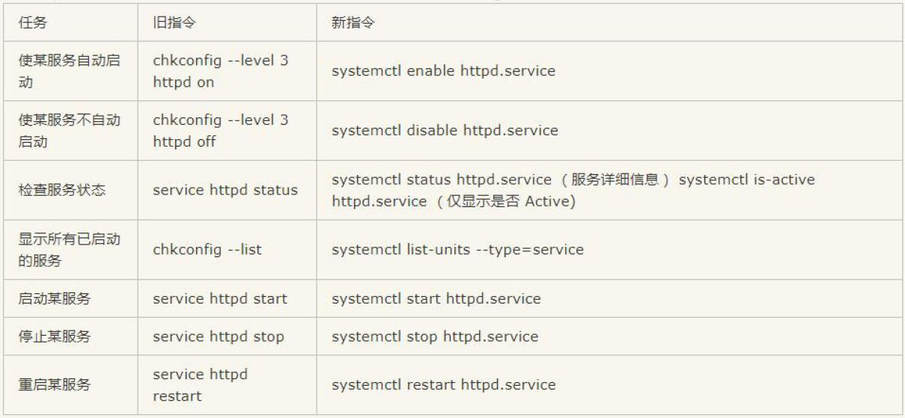
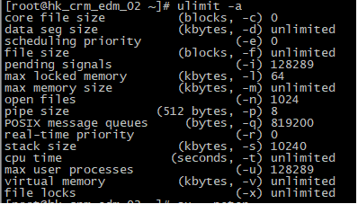

## 常用命令
### systemctl管理服务常用命令
systemctl 就是service 和chkconfig 这两个命令的整合，在CentOS 7 就开始被使用了,systemctl是系统服务管理器命令，它实际上将service 和chkconfig 这两个命令组合到一起

- 1、启动服务：`systemctl start httpd`
- 2、关闭服务：`systemctl stop httpd`
- 3、重启服务：`systemctl restart httpd`
- 4、查看一个服务的状态：`systemctl status httpd`
- 5、查看一个服务是否在运行：`systemctl is-active httpd`
- 6、查看当前已经运行的服务：`systemctl list-units -t service`
- 7、列出所有服务： `systemctl list-units -at service` 注意顺序
- 8、设置开机自启动： `systemctl enable httpd`
- 9、停止开机自启动： `systemctl disable httpd`
- 10、列出所有自启动服务：
```
systemctl list-unit-files|grep enabled
systemctl list-unit-files|grep disabled
systemctl list-unit-files|grep disabled | grep httpd
```
- 11、使指定服务从新加载配置：`systemctl reload httpd`
- 12、查看服务是否开机启动：`systemctl is-enabled firewalld.service`
- 13、查看已启动的服务列表：`systemctl list-unit-files|grep enabled`
- 14、查看启动失败的服务列表：`systemctl --failed`
### 关机重启
```
init 0                  # 关机
shutdown -h now         
init 6                  #重启 
reboot                 
```
### 用户管理
```
useradd zhangsan                  # 添加用户
passwd zhangsan                   # 设置密码
userdel -rf zhangsan              # 删除用户, -r：递归的删除目录下面文件以及子目录下文件
id zhangsan                       # 查看用户
groups                            # 查看当前登录用户的组内成员
groups zhangsan                   # 查看zhangsan所在的组,zhangsan : zhangsan
gpasswd -a zhangsan  root         # 把张三追加到root组中,zhangsan : zhangsan root
gpasswd -d zhangsan  root         # 把用户移出root组
cat /etc/passwd                   # 查看所有的用户信息
cat /etc/group                    # 查看所有组信息
```
### 打包管理
#### 1.zip压缩包
```
yum install -y unzip zip         # 安装zip
zip -r public.zip public         # 制作压缩包public.zip,-r 递归 表示将指定的目录下的所有子目录以及文件一起处理
unzip public.zip                 # 解压到当前目录
unzip public.zip -d dir          # 解压到指定目录
nzip -l public.zip               # 查看public.zip中的内容
```
#### 2. gz压缩包
Linux下最常用的打包程序就是tar了，使用tar程序打出来的包我们常称为tar包，tar包文件的命令通常都是以.tar结尾的。生成tar包后，就可以用其它的程序来进行压缩了。
```
tar czvf public.tar.gz public          # 制作gz包
tar xzvf public.tar.gz                 # 解压gz包
tar tf public.tar.gz                   # 查看gz包
tar cvf wwwroot.tar wwwroot            # 制作tar包，仅打包，不压缩！
tar xvf wwwroot.tar                    # 解压tar包
```
参数说明,`c/x/t` 仅能存在一个！不可同时存在！因为不可能同时压缩与解压缩
```
-c  ：建立一个压缩档案的参数指令(create 的意思)
-x  ：解开一个压缩档案的参数指令！
-t  ：查看 tarfile 里面的档案！
-z  ：是否同时具有 gzip 的属性？亦即是否需要用 gzip 压缩？
-j  ：是否同时具有 bzip2 的属性？亦即是否需要用 bzip2 压缩？
-v  ：压缩的过程中显示档案！这个常用，但不建议用在背景执行过程！
-f  ：使用档名，请留意，在 f 之后要立即接档名喔！不要再加参数！
```
#### 3.xz压缩包
xz是绝大数linux默认就带的一个压缩工具，xz格式比7z还要小
+ 1.制作
```
tar cvf xxx.tar xxx     # 创建xxx.tar文件先，
xz  xxx.tar             # 将xxx.tar压缩成为 xxx.tar.xz	   删除原来的tar包
xz  -k xxx.tar          # 将 xxx.tar压缩成为 xxx.tar.xz	  保留原来的tar包
```
+ 2.解压
```
xz  -d  ***.tar.xz     # 先解压xz   删除原来的xz包
xz  -dk  ***.tar.xz    # 先解压xz  保留原来的xz包
tar -xvf  ***.tar      # 再解压tar
```
+ 3.查看
```
xz  -l  ***.tar.xz     # 查看xz
```
### rpm软件安装卸载
```
1、挂载光盘
    1、mount dev/cdrom /media             # 挂载
    2、df  查看光盘是否挂载
    3、卸载umount /media
2、rpm安装
    rpm -ivh rpm软件包
3、rpm卸载软件
    rpm -e net-tools                      # net-tools表示要卸载的软件包
4、查看rpm软件包的安装位置 / 软件包是否安装
    rpm -ql net-tools
```
### yum软件安装卸载
```
1、yum安装rpm包
    yum install -y net-tools                # 包括 netstat ifconfig等命令
    yum install -y unzip zip                # zip压缩减压
    yum install -y mlocate                  # updatedb
    yum install -y wget                     # 下载文件包
    yum -y install psmisc                   # pstree | grep httpd   查看进程    pstree -p   显示进程以及子进程
2、yum卸载rpm包
    yum -y remove wget
3.yum搜索npm包
    yum search 名称
4.yum查看rpm包
    yum list 
    yum list | grep httpd
    yum list updates  列出所有可更新的软件包
    yum list installed   列出所有已安装的软件包
5.yum显示rpm包信息
    yum info package1
    如：
    yum info httpd   
    yum info zip
    yum info unzip
6、yum 安装Apache 
    yum -y install httpd                     # 安装启动apache
    1、启动apache      service httpd start   
    2、关闭防火墙      systemctl stop firewalld
yum的主配置文件 etc/yum.conf 
yum的仓库配置文件 /etc/yum.repo.d/*.repo
```
### 端口占用情况
####  lsof -i:端口号
```
yum install lsof -y
lsof -i:端口号 用于查看某一端口的占用情况，比如查看8000端口使用情况，lsof -i:8000
```
#### lsof
+ 格式`lsof ［options］ filename`
+ 常用参数列表
```
lsof  filename 显示打开指定文件的所有进程
lsof -a 表示两个参数都必须满足时才显示结果
lsof -c string   显示COMMAND列中包含指定字符的进程所有打开的文件
lsof -u username  显示所属user进程打开的文件
lsof -g gid 显示归属gid的进程情况
lsof +d /DIR/ 显示目录下被进程打开的文件
lsof +D /DIR/ 同上，但是会搜索目录下的所有目录，时间相对较长
lsof -d FD 显示指定文件描述符的进程
lsof -n 不将IP转换为hostname，缺省是不加上-n参数
lsof -i 用以显示符合条件的进程情况
lsof -i[46] [protocol][@hostname|hostaddr][:service|port]
            46 --> IPv4 or IPv6
            protocol --> TCP or UDP
            hostname --> Internet host name
            hostaddr --> IPv4地址
            service --> /etc/service中的 service name (可以不只一个)
            port --> 端口号 (可以不只一个)
```
+ 使用
```
lsof -a -u root -d txt           # 查看所属root用户进程所打开的文件类型为txt的文件
lsof -u ^root                    # 列出除了root用户外的被打开的文件信息
lsof |grep /var/log/messages     # 查看当前是否有进程打开/var/logmessages文件
lsof -c mysql                    # 列出mysql程序进程所打开的文件信息,也可以写成`lsof | grep mysql`
lsof -p 1                        # 通过某个进程号显示该进行打开的文件
lsof -p 1,2,3                    # 列出多个进程号对应的文件信息
lsof -p ^1                       # 列出除了某个进程号，其他进程号所打开的文件信息
lsof -i                          # 列出所有的网络连接
lsof -i tcp                      # 列出所有tcp 网络连接信息
lsof -i udp                      # 列出所有udp网络连接信息
lsof -i :3306                    # 查看3306端口现在运行的情况
lsof -i tcp:80                   # 列出谁在使用某个特定的tcp端口
lsof -i udp:55                   # 列出谁在使用某个特定的udp端口
lsof -a -u peter -i              # 列出某个用户的所有活跃的网络端口

```
####netstat -tunlp |grep 端口号
```
netstat -tunlp |grep 端口号，用于查看指定的端口号的进程情况，如查看8000端口的情况，netstat -tunlp |grep 8000
-t (tcp) 仅显示tcp相关选项
-u (udp)仅显示udp相关选项
-n 拒绝显示别名，能显示数字的全部转化为数字
-l 仅列出在Listen(监听)的服务状态
-p 显示建立相关链接的程序名
```
###  ACL
+ 命令
    - 1.查看opt拥有的acl权限           `getfacl opt/`
    - 2.设置opt的acl权限               `setfacl -m u:zhangsan:rwx opt/`-m添加权限
    - 3.删除opt的user1拥有的acl权限     `setfacl -x u:zhangsan opt/` -x删除权限
    - 4.删除opt上所设置过的所有acl权限   `setfacl -b opt/`
+ 需求： 让zhangsan 对opt 目录具有rx 权限，让lisi 对opt 目录具有rwx 的权限
```
setfacl -m u:zhangsan:rx opt/
setfacl -m u:lisi:rwx opt/
```
###  用户权限管理visudo,sbin下面的命令执行权限
+ 1.设置
```
		输入：   visudo   
		编辑     %zhangsan localhost=/usr/sbin/useradd
				 %zhangsan localhost=/usr/sbin/userdel
```
+ 2.使用  普通用户家sudo
        sudo useradd wangwu
        sudo userdel wangwu


## 网络
### 网络命令
最小化安装CentOs 后是没法直接用ifconfig、netstat 命令的，如果要用ifconfig、netstat 等命令需要安装net-tools,`yum install -y net-tools`
```
ip addr
```
### SELinux
安全增强型Linux（Security-Enhanced Linux）简称SELinux，它是一个Linux 内核模块，也是Linux 的一个安全子系统。SELinux 主要由美国国家安全局开发。2.6 及以上版本的Linux 内核都已经集成了SELinux 模块。SELinux 的结构及配置非常复杂，而且有大量概念性的东西，要学精难度较大。很多Linux 系统管理员嫌麻烦都把SELinux 关闭了。
- 查看SELinux 状态
    - 1、`/usr/sbin/sestatus -v` ##如果SELinux status 参数为enabled 即为开启状态 `SELinux status: enabled`
    - 2、`getenforce` ##也可以用这个命令检查
- 关闭SELinux
    - 1、临时关闭（不用重启机器）
    ```
    setenforce 0 ##设置SELinux 成为permissive 模式
    setenforce 1 设置SELinux 成为enforcing 模式
    ```
    - 2、修改配置文件需要重启机器,修改`/etc/selinux/config` 文件,将`SELINUX=enforcing `改为`SELINUX=disabled`
### 如果安装的时候忘记开启网络我们可以在配置文件中开启网络
```
vi /etc/sysconfig/network-scripts/ifcfg-ens33
ONBOOT=’no’修改为yes
重启网络
service network restart
```
### 修改hostname
```
vim /etc/sysconfig/network
vim /etc/hosts
hostnamectl set-hostname cloud-02 
reboot 或者exit重新登陆
```
### 防火墙
#### 1.firewalld的基本使用
```
systemctl start firewalld          # 启动      
systemctl stop firewalld           # 关闭
systemctl status firewalld         # 查看状态
systemctl disable firewalld        # 开机禁用
systemctl enable firewalld         # 开机启用
```
#### 2.firewall-cmd的基本使用-开启端口
```
firewall-cmd --version                                         # 查看版本
firewall-cmd --help                                            # 查看帮助
firewall-cmd --state                                           # 查看状态
firewall-cmd --zone=public --list-ports                        # 查看所有打开的端口
firewall-cmd --reload                                          # 更新防火墙规则
firewall-cmd --get-active-zones                                # 查看区域信息
firewall-cmd --get-zone-of-interface=eth0                      # 查看指定接口所属区域
firewall-cmd --panic-on                                        # 拒绝所有包
firewall-cmd --panic-off                                       # 取消拒绝状态
firewall-cmd --query-panic                                     # 查看是否拒绝
firewall-cmd --zone=public --add-port=80/tcp --permanent       # 开启端口:（–permanent永久生效，没有此参数重启后失效）  
firewall-cmd --reload                                          # 重新载入: 修改firewall-cmd配置后必须重启
firewall-cmd --zone= public --query-port=80/tcp                # 查看:  修改firewall-cmd配置后必须重启 
firewall-cmd --zone= public --remove-port=80/tcp --permanent   # 删除:              
firewall-cmd --zone=public --list-ports                        # 查看所有打开的端口：
```

## fdisk & mount
```
fdisk -l                                                                           # 查看新加入的硬盘
fidsk /dev/xvdb -> m 获取帮助 -> n 添加分区 -> p 主分区 -> w 写分区
yum -y install e4fsprogs
mkfs -t ext4 /dev/xvdb1
mount /dev/xvdb1 /mnt
vim /etc/fstab   
/dev/xvdb1  /mnt      ext4    defaults        0 0
```

## 常用配置
### hostname
```
# 一旦修改了静态主机名，/etc/hostname 将被自动更新。然而，/etc/hosts 不会更新以保存所做的修改，所以你每次在修改主机名后一定要手动更新/etc/hosts，之后再重启CentOS 7。否则系统再启动时会很慢
hostnamectl set-hostname node_master                       # 修改hostname
```
### 安装EPEL
```
rpm -ivh https://dl.fedoraproject.org/pub/epel/epel-release-latest-7.noarch.rpm
yum -y install epel-release
yum clean all && yum makecache         # 清除系统所有的yum缓存 和 生成yum缓存
yum repolist
```

## 应用
```
find ./ -type f -mtime +7 -print -exec rm -f {} \;
```

## too many open files
`ulimit -a      # 可以查看`
其中 open files (-n) 1024 表示每个用户最大允许打开的文件数量是1024

```
lsof | wc -l                      # 查看当前系统打开的文件数量
lsof -p pid | wc -l               # 查看某一进程的打开文件数量
ulimit -n 2048                    # 设置open files数值方法，这种设置方法在重启后会还原为默认值
```
+ 永久设置方法
```
vim /etc/security/limits.conf
在最后加入
* soft nofile 4096
* hard nofile 4096
```
最前的 * 表示所有用户，可根据需要设置某一用户，例如
```
fdipzone soft nofile 8192
fdipzone hard nofile 8192
```