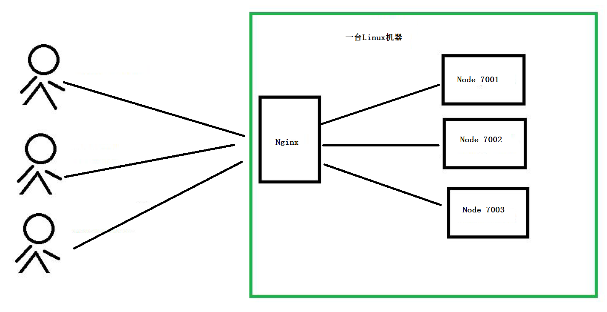
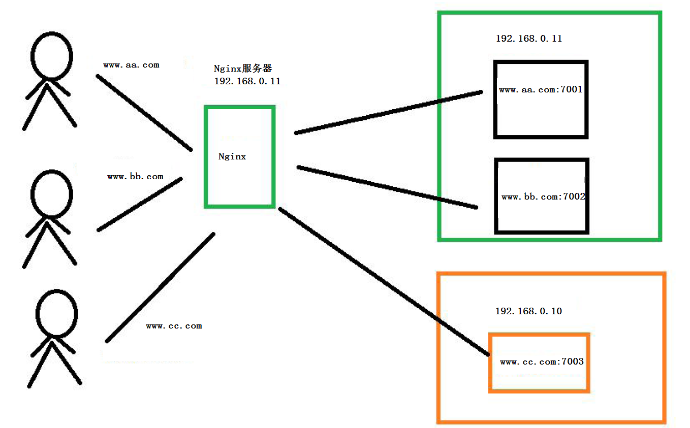

# 1. 反向代理使用方式1--proxy_pass
## 1. 拓扑结构

## 2. nginx 安装-yum安装
- 1、安装nginx源
    `sudo rpm -ivh http://nginx.org/packages/centos/7/noarch/RPMS/nginx-release-centos-7-0.el7.ngx.noarch.rpm`
- 2、查看Nginx源是否配置成功　
    通过`yum search nginx`看看是否已经添加源成功。如果成功则执行下列命令安装Nginx。
    或者 `npm info nginx`也可以看看nginx源是否添加成功
- 3、安装Nginx 
    `sudo yum install -y nginx`
- 4、启动Nginx并设置开机自动运行 
```
    sudo systemctl start nginx.service
    sudo systemctl enable nginx.service
```
- 5. 访问`http://127.0.0.1`测试是否正常

## 3. Nginx 反向代理配置
### 1、关闭Selinux
```
vi /etc/selinux/config
修改 SELINUX=enforcing 为 SELINUX=disabled
```
### 2.配置反向代理
#### 1. 首先添加配置文件
```
cd /etc/nginx/conf.d
touch www_aa_com.conf
touch www_bb_com.conf
touch www_cc_com.conf
```
#### 2.配置文件，以`www_aa_com.conf`为例说明
只需要修改两处地方
- 修改server中 `server_name`为用户访问的域名,例如`www.aa.com`
- 在server中location中添加`proxy_pass http://127.0.0.1:7001;`
```
server {
    listen       80;
    server_name  www.aa.com;
    location / {
	#设置主机头，以便服务器获取客户端真实IP
	proxy_set_header Host $host;
	proxy_set_header X-Real-IP $remote_addr;
	proxy_set_header X-Forwarded-For $proxy_add_x_forwarded_for;
	proxy_buffering off;  #禁用缓存
	proxy_pass http://127.0.0.1:7001; #反向代理的地址
    }
}
```
### 3.重启nginx
```
systemctl restart nginx
nginx -t                    #看配置是否正确
systemctl stop nginx
systemctl start nginx
```
### 4.开启ngix 80端口
```
firewall-cmd --zone=public --list-ports
firewall-cmd --zone=public --add-port=80/tcp --permanent
firewall-cmd --reload  
```
### 5. 启动node程序
```
pm2 start app.js --name www_aa_com
pm2 start app.js --name www_bb_com
pm2 start app.js --name www_cc_com
```
### 6. 域名添加
```
C:\Windows\System32\drivers\etc\hosts
192.168.0.11 www.aa.com
192.168.0.11 www.bb.com
192.168.0.11 www.cc.com
```
### 7. 测试
浏览器输入
```
www.aa.com       当访问www.aa.com的时候实际上，nginx 转发到了127.0.0.1:7001对应的node服务
www.bb.com       当访问www.bb.com的时候实际上，nginx 转发到了127.0.0.1:7002对应的node服务
www.cc.com       当访问www.cc.com的时候实际上，nginx 转发到了127.0.0.1:7003对应的node服务
```


# 2.反向代理使用方式2--upstream lbproxyaa,只配置一个ip，实现转发
## upstream
nginx 的upstream 目前支持3 种方式的分配:
- 1)、轮询（默认）。每个请求按时间顺序逐一分配到不同的后端服务器，如果后端服务器down 掉，能自动剔除。
- 2)、weight 权重——you can you up。指定轮询几率，weight 和访问比率成正比，用于后端服务器性能不均的情况。
- 3)、ip_hash ip 哈希算法。每个请求按访问ip 的hash 结果分配，这样每个访客固定访问一个后端服务器，==>可以解决session 的问题。
## 配置文件，以www_aa.com为例
```
upstream lbproxyaa {
	ip_hash;
	server 127.0.0.1:7001 ; 
}
server {
    listen       80;
    server_name  www.aa.com;
    #charset koi8-r;
    #access_log  /var/log/nginx/host.access.log  main;
    location / {
	#设置主机头和客户端真实地址，以便服务器获取客户端真实 IP
	proxy_set_header Host $host;
	proxy_set_header X-Real-IP $remote_addr;
	proxy_set_header X-Forwarded-For $proxy_add_x_forwarded_for;
	#禁用缓存
	proxy_buffering off;
	proxy_pass http://lbproxyaa;
    }
    #error_page  404              /404.html;
    # redirect server error pages to the static page /50x.html
    #
    error_page   500 502 503 504  /50x.html;
    location = /50x.html {
        root   /usr/share/nginx/html;
    }

}
```
## 测试
当访问www.aa.com的时候实际上，nginx通过负载均衡转发到了127.0.0.1:7001对应的node服务


# 3. nginx实现负载均衡

在nginx的机器，config中配置多个机器机器列表，实现负载聚会，nginx会根据用户ip，转发到不同的node服务上
```
upstream lbaa {
	ip_hash;
	server 127.0.0.1:7001 weight=1; 
	server 127.0.0.1:7002 weight=1;
	server 192.168.0.10:7003 weight=3;
}
```
## upstream
nginx 的upstream 目前支持3 种方式的分配:
- 1)、轮询（默认）。每个请求按时间顺序逐一分配到不同的后端服务器，如果后端服务器down 掉，能自动剔除。
- 2)、weight 权重——you can you up。指定轮询几率，weight 和访问比率成正比，用于后端服务器性能不均的情况。
- 3)、ip_hash ip 哈希算法。每个请求按访问ip 的hash 结果分配，这样每个访客固定访问一个后端服务器，==>可以解决session 的问题。
## 配置文件
```
upstream lbaa {
	ip_hash;
	server 127.0.0.1:7001 weight=1; 
	server 127.0.0.1:7002 weight=1;
	server 192.168.0.10:7003 weight=3;
}

server {
    listen       80;
    server_name  www.aa.com;

    #charset koi8-r;
    #access_log  /var/log/nginx/host.access.log  main;

    location / {
	#设置主机头和客户端真实地址，以便服务器获取客户端真实 IP
	proxy_set_header Host $host;
	proxy_set_header X-Real-IP $remote_addr;
	proxy_set_header X-Forwarded-For $proxy_add_x_forwarded_for;
	#禁用缓存
	proxy_buffering off;
        
	proxy_pass http://lbaa;
    }

    #error_page  404              /404.html;
    # redirect server error pages to the static page /50x.html
    #
    error_page   500 502 503 504  /50x.html;
    location = /50x.html {
        root   /usr/share/nginx/html;
    }
}

```
## 测试
为了测试效果，可以将ip_hash去掉，默认是轮询的方式