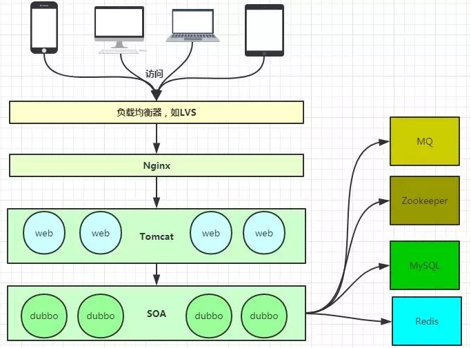
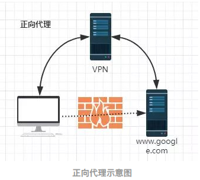
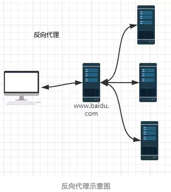
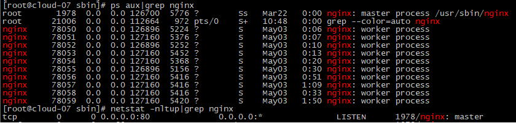
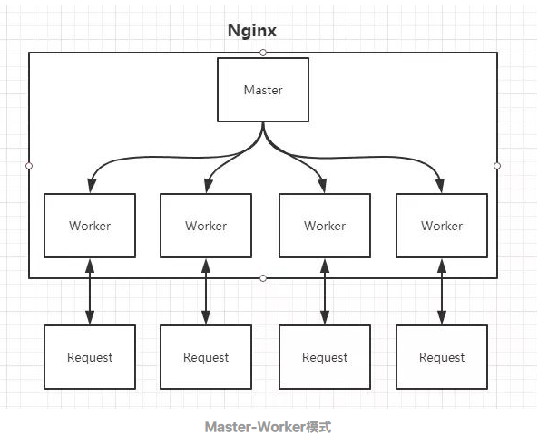
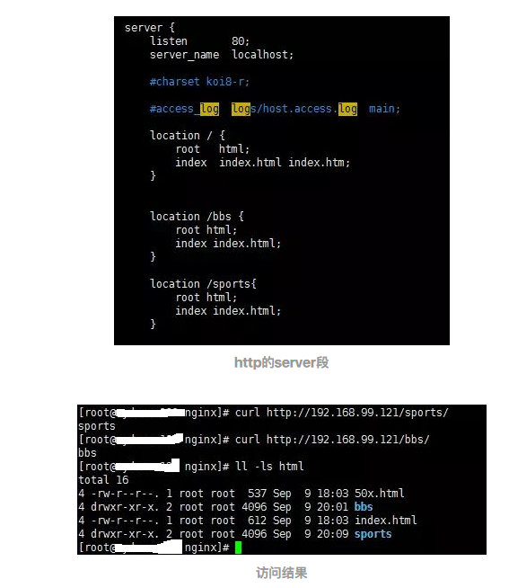

## 概述
Nginx是一款轻量级的Web服务器、反向代理服务器，由于它的内存占用少，启动极快，高并发能力强，在互联网项目中广泛应用

上图基本上说明了当下流行的技术架构，其中Nginx有点入口网关的味道
## 反向代理服务器？
经常听人说到一些术语，如反向代理，那么什么是反向代理，什么又是正向代理呢？
+ 正向代理

+ 反向代理

由于防火墙的原因，我们并不能直接访问谷歌，那么我们可以借助VPN来实现，这就是一个简单的正向代理的例子。这里你能够发现，正向代理“代理”的是客户端，而且客户端是知道目标的，而目标是不知道客户端是通过VPN访问的

当我们在外网访问百度的时候，其实会进行一个转发，代理到内网去，这就是所谓的反向代理，即反向代理“代理”的是服务器端，而且这一个过程对于客户端而言是透明的。

## Nginx的Master-Worker模式

启动Nginx后，其实就是在80端口启动了Socket服务进行监听，如图所示，Nginx涉及Master进程和Worker进程

### Master进程的作用是?
+ 读取并验证配置文件nginx.conf
+ 管理worker进程

### Worker进程的作用是？
+ 每一个Worker进程都维护一个线程（避免线程切换），处理连接和请求
+ 注意Worker进程的个数由配置文件决定，一般和CPU个数相关（有利于进程切换），配置几个就有几个Worker进程,也可以配置为auto
  
## epoll模型
Nginx采用了Linux的epoll模型，epoll模型基于事件驱动机制，它可以监控多个事件是否准备完毕，如果OK，那么放入epoll队列中，这个过程是异步的。worker只需要从epoll队列循环处理即可。

## Keepalived+Nginx实现高可用
Nginx既然作为入口网关，很重要，如果出现单点问题，显然是不可接受的,可以通过Keepalived+Nginx实现高可用
Keepalived是一个高可用解决方案，主要是用来防止服务器单点发生故障，可以通过和Nginx配合来实现Web服务的高可用。（其实，Keepalived不仅仅可以和Nginx配合，还可以和很多其他服务配合）

## 虚拟主机

其实这是把Nginx作为web server来处理静态资源
+ location可以进行正则匹配，应该注意正则的几种形式以及优先级
+ Nginx能够提高速度的其中一个特性就是：动静分离，就是把静态资源放到Nginx上，由Nginx管理，动态请求转发给后端
+ 我们可以在Nginx下把静态资源、日志文件归属到不同域名下（也即是目录），这样方便管理维护。
+ Nginx可以进行IP访问控制，有些电商平台，就可以在Nginx这一层，做一下处理，内置一个黑名单模块，那么就不必等请求通过Nginx达到后端在进行拦截，而是直接在Nginx这一层就处理掉。
## 反向代理【proxy_pass】
所谓反向代理，很简单，其实就是在location这一段配置中的root替换成proxy_pass即可。root说明是静态资源，可以由Nginx进行返回；而proxy_pass说明是动态请求，需要进行转发，比如代理到Tomcat上。

反向代理，上面已经说了，过程是透明的，比如说request -> Nginx -> Tomcat，那么对于Tomcat而言，请求的IP地址就是Nginx的地址，而非真实的request地址，这一点需要注意。不过好在Nginx不仅仅可以反向代理请求，还可以由用户自定义设置HTTP HEADER
## 负载均衡【upstream】

上面的反向代理中，我们通过proxy_pass来指定Tomcat的地址，很显然我们只能指定一台Tomcat地址，那么我们如果想指定多台来达到负载均衡呢？
+ 通过upstream来定义一组Tomcat，并指定负载策略（IPHASH、加权论调、最少连接），健康检查策略（Nginx可以监控这一组Tomcat的状态）等
+ 将proxy_pass替换成upstream指定的值即可

### 负载均衡可能带来的问题？
负载均衡所带来的明显的问题是，一个请求，可以到A server，也可以到B server，这完全不受我们的控制，当然这也不是什么问题，只是我们得注意的是：用户状态的保存问题，如Session会话信息，不能在保存到服务器上