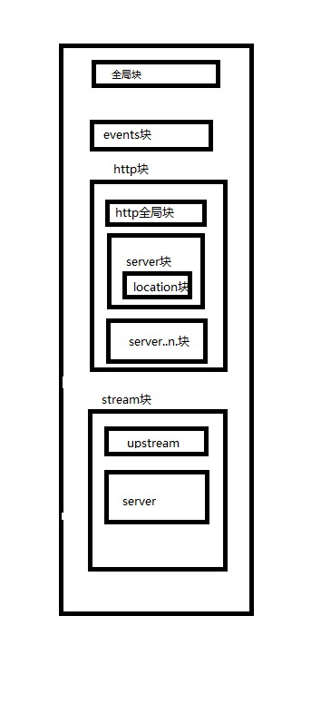
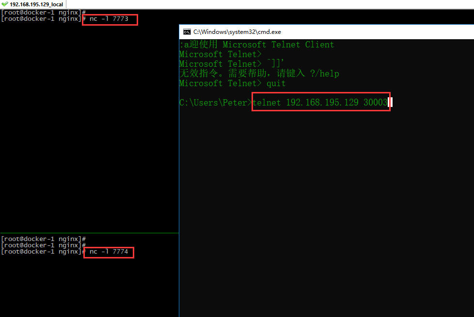

## Nginx 配置TCP/UDP端口转发
nginx 的功能非常强大，其中作为代理服务器是非常常用的功能，但是之前的nginx代理只能做七层代理，也就说是基于应用层面的代理，TCP层面的代理一般会配合haproxy 来使用。但是自从nginx 1.9 以后通过stream模块实现了tcp 代理功能，无需其他软件配合即可实现四层代理和七层代理，即：访问该服务器的指定端口，nginx就可以充当端口转发的作用将流量导向另一个服务器，同时获取目标服务器的返回数据并返回给请求者。nginx的TCP代理功能跟nginx的反向代理不同的是：请求该端口的所有流量都会转发到目标服务器，而在反向代理中可以细化哪些请求分发给哪些服务器；另一个不同的是，nginx做TCP代理并不仅仅局限于WEB的URL请求，还可以转发如memcached、MySQL等点到点的请求


192.168.195.129 nginx监听30003端口，然后开两个窗口，用nc监听 7773，7774端口
```
                          / nc -l 7773
telnet--> nginx(30003) -->
                          \ nc -l 7774
```

## 1.安装nginx服务
[安装nginx](https://github.com/obligate/doc/blob/master/linux/centos7.x/nginx安装.md)

> 对于已经安装nginx的，检查是否编译时带with-stream参数 `nginx -V |grep with-stream`  有with-stream参数，可以代理tcp协议

## 2.配置nginx的tcp代理
**请注意，stream块和http块是两个不同的模块，stream不属于http模块，即不能放到/etc/nginx/conf.d/，stream是通过tcp层转发，而不是http转发，如配置在http内，启动nginx会报如下错误**
`nginx: [emerg] "server" directive is not allowed here`



### 2.1 修改主配置文件，添加stream目录
```
cd /etc/nginx/
cp -a nginx.conf{,_$(date +%F)}
vim nginx.conf
# 最后追加如下内容
# tcp/ip proxy
include /etc/nginx/tcp.d/*.conf;
```
### 2.2 添加tcp转发配置
```
mkdir tcp.d
cd tcp.d
```
+ 在新建的 tcp.d 目录下创建 conf 文件新建一个 tcp 配置,例如我转发到IP为8.8.8.8的389端口
```
[root@node1 ~]# vim tcp_localhost.conf
stream{
    upstream tcpssh{
        hash $remote_addr consistent;                          # $remote_addr 客户端地址
        server 127.0.0.1:7773;
        server 127.0.0.1:7774;  
    }
    server{
        listen 30003;
        proxy_connect_timeout 20s;
        proxy_timeout 5m;
        proxy_pass tcpssh;
    }
}
```
说明：
"upstream tcpssh"：转发的目的地址和端口等设置；其中tcpssh为自定义；
"server"：提供转发的服务，即访问localhost:30003，会跳转至代理"tcpssh"指定的转发地址.。
这里就是配置的监听本地30003端口，会将流量相应转发到指定ip服务器的7773或者7774端口上

+ 测试配置文件是否正确
```
nginx -t -c /etc/nginx/nginx.conf
nginx -t -c /etc/nginx/tcp.d/tcp_localhost.conf
```


### 2.3 启动nginx服务
```
systemctl start nginx.service
systemctl status nginx.service      # 查看是否启动
```


## 客户端配置

```
telnet 192.168.195.129 30003
开启两个窗口执行
窗口1
nc -l 7773
窗口2
nc -l 7774
```
