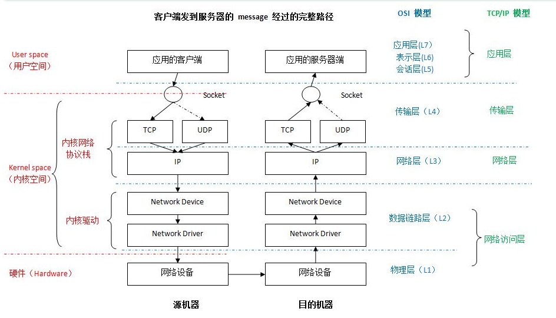

## 协议栈和网卡的相关知识——基本概念

+ IP （Internet Protocol, 网际协议：负责网络包的收发
+ ICMP（Internet Control Messages Protocol, 网际控制报文协议)：用于告知网络包在传输过程中 产生的错误 和 各种控制消息
+ ARP（Address Resolution Protocol, 地址解析协议）：用于根据 IP 地址查询相应的 以太网 MAC 地址
+ MAC（Medium Access Control，媒体访问控制 | 物理地址 | 硬件地址)
+ 连接的本质：连接的本质实际上就是通信双方 交换控制信息

## Bridge
当刚创建一个bridge时，它是一个独立的网络设备，只有一个端口连着协议栈，其它的端口啥都没连，这样的bridge没有任何实际功能

## Refer
[Linux虚拟网络设备之bridge(桥)](https://segmentfault.com/a/1190000009491002)