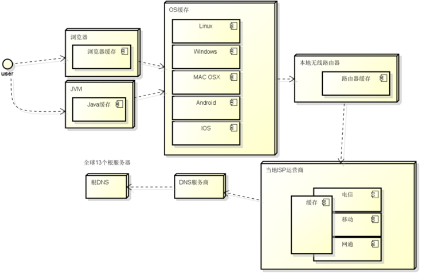

## getopts
+ getopts是shell的一个内置命令,被shell程序用来分析位置参数,用于获取命令行中的参数
    + 语法： `getopts optstring name [args]`
    + 内置变量: `OPTIND,OPTARG,OPTERR`
+ getopts 后面的字符串就是可以使用的选项列表，每个字母代表一个选项，后面带:的意味着选项除了定义本身之外，还会带上一个参数作为选项的值，比如 a:在实际的使用中就会对应-a 11，选项的值就是 11；getopts 字符串中没有跟随:的是开关型选项，不需要再指定值，相当于 true/false，只要带了这个参数就是 true。如果命令行中包含了没有在 getopts 列表中的选项，会有警告信息，如果在整个 getopts 字符串前面也加上个:，就能消除警告信息了
+ optstring
  + 包含需要被识别的选项字符，如果这里的字符后面跟着一个冒号，表明该字符选项需要传入一个参数，如果不传入回报错，例如`a:`、`a:b:`,`ab:`,`:a:b:`,`:ab:`
  + 传入参数需要以空格分隔`-a 1`。冒号和问号不能被用作选项字符
+ name
  + getopts每次被调用时，它会将下一个选项字符放置到变量name
> optstring选项之间使用冒号:分隔`a:b`，也可以直接连接`ab:`， `:`表示选项后面需要传值，不加`:`表示选项后面不需要传值
> 当getopts命令发现冒号后，会从命令行该选项后读取该值,如该值存在，将保存在特殊的变量OPTARG中
> 当option_string用`:`开头,则会进入静默模式，getopts会区分invalid option错误和miss option argument错误，invalid option时, name会被设成`?`即`name=?`,miss option argument时，name会被设成`:`即`name=:`
> 当option_string不用`:`开头，invalid option错误和miss option argument错误都会使name被设成`?`即`name=?`
+ `OPTARG` 保存选项后的参数值
+ `OPTIND` 表示命令行下一个选项或参数的索引
### 使用getopts命令获取参数
+ 创建文件`vim test_getopts_1.sh`
```
#!/bin/bash
while getopts a:b:c:d opts; do
    case $opts in
        a) a=$OPTARG ;;
        b) b=$OPTARG ;;
        c) c=$OPTARG ;;
        d) d=$OPTARG ;;
        ?) ;;
    esac
done

echo "a=$a"
echo "b=$b"
echo "c=$c"
echo "d=$d"

exit 0
```
+ 执行1
```
./test_getopts_1.sh -a 1 -b 2 -c 3 -d 4
a=1
b=2
c=3
d=
```
> option_string `a:b:c:d`, a,b,c后都有`:`，d后没有`: ` **所以可以获取到a,b,c的值** 

+ 执行2 `-c 不传值`,此时会报错，如何解决，可以在option_string前加`:`
```
./test_getopts_1.sh -a 1 -b 2 -c
./test_getopts_1.sh: option requires an argument -- c
a=1
b=2
c=
d=
```
### option_string前加:进入静默模式
+ 上例执行2中，如果a,b,c任意一个没有传值，将会提示出错。例如 -c 不传值
+ 我们在option_string前加上:，则可以屏蔽这个错误
+ 修改代码`vim test_getopts_2.sh`
```
#!/bin/bash

while getopts :a:b:c:d opts; do
    case $opts in
        a) a=$OPTARG ;;
        b) b=$OPTARG ;;
        c) c=$OPTARG ;;
        d) d=$OPTARG ;;
        ?) ;;
    esac
done

echo "a=$a"
echo "b=$b"
echo "c=$c"
echo "d=$d"

exit 0
```
+ 执行1输出
```
./test_getopts_2.sh -a 1 -b 2 -c
a=1
b=2
c=
d=
```
+ 执行2输出,例如缺失a的传值，命令会把-a后的-b作为了-a的值，导致错误
```
./test_getopts_2.sh -a -b 2 -c 3
a=-b
b=
c=
d=
```
+ 执行3输出，例如a不传值，则-a不要加入命令行
```
./test_getopts_2.sh -b 2 -c 3
a=
b=2
c=3
d=
```
> 在option_string前加上:，可以屏蔽缺失传值的错误，但如果缺失的是前面选项的值，那么获取到的值将会错误,参见执行2输出
> 因此使用getopts命令时，对于没有传值的选项，选项名称不要加入命令行中，参见执行3输出


### optstring选项之间直接连接
+ optstring选项之间直接连接`ab:`，相当于a可以不用传入值，b后面有`:`需要传入值,执行的时候可以传入`-ab 1`或者`-b 1`
+ 创建文件`vim test_getopts_3.sh`
```
#!/bin/sh
while getopts :ab:c: OPTION;do
    case $OPTION in
    a)echo "get option a and parameter is $OPTARG" ;; 
    b)echo "get option b and parameter is $OPTARG" ;; 
    c)echo "get option c and parameter is $OPTARG" ;; 
    ?)echo "get a non option $OPTARG and OPTION is $OPTION" ;; 
    esac
done
```
+ 执行1输出
```
./test_getopts_3.sh -ab 1 -p -c
get option a and parameter is         # a后面没有:，getopts不会读取值
get option b and parameter is 1
get option c and parameter is ?
get a non option $OPTARG and OPTION is :
```
>-a和-b是正确的选项，-p和-c分别对应错误选项的两种情况
+ 执行2 输出
```
./test_getopts_3.sh -a 1 -b 1
get option a and parameter is 
```
+ 执行3输出
```
./test_getopts_3.sh  -b 1 -c 1
get option b and parameter is 1
get option c and parameter is 1
```


## dig
### 常用命令
```
# 默认 dig rss.newyingyong.cn 返回的是 A 记录类型，其他类型还包括 MX、NS、SOA 等，我们可以使用 dig -t a/mx/soa/mx rss.newyingyong.cn 进行查询
dig -t a www.weibo.com +noall +answer                          
```

```
$ dig +trace www.moehot.com 

; <<>> DiG 9.9.4-RedHat-9.9.4-72.el7 <<>> +trace www.moehot.com
;; global options: +cmd
.           518382  IN  NS  a.root-servers.net.
.           518382  IN  NS  b.root-servers.net.
.           518382  IN  NS  c.root-servers.net.
.           518382  IN  NS  d.root-servers.net.
.           518382  IN  NS  e.root-servers.net.
.           518382  IN  NS  g.root-servers.net.
.           518382  IN  NS  h.root-servers.net.
.           518382  IN  NS  i.root-servers.net.
.           518382  IN  NS  j.root-servers.net.
.           518382  IN  NS  k.root-servers.net.
.           518382  IN  NS  l.root-servers.net.
.           518382  IN  NS  m.root-servers.net.
.           518382  IN  NS  root1.sc163.net.
.           518382  IN  NS  root2.sc163.net.
.           518382  IN  NS  b.root-servers.net.
.           518382  IN  NS  c.root-servers.net.
.           518382  IN  NS  d.root-servers.net.
.           518382  IN  NS  e.root-servers.net.
.           518382  IN  NS  g.root-servers.net.
.           518382  IN  NS  h.root-servers.net.
.           518382  IN  NS  i.root-servers.net.
.           518382  IN  NS  j.root-servers.net.
.           518382  IN  NS  k.root-servers.net.
.           518382  IN  NS  l.root-servers.net.
.           518382  IN  NS  m.root-servers.net.
.           518382  IN  NS  root1.sc163.net.
.           518382  IN  NS  root2.sc163.net.
.           518382  IN  NS  a.root-servers.net.
;; Received 631 bytes from 10.0.0.1#53(10.0.0.1) in 54 ms

com.            172800  IN  NS  i.gtld-servers.net.
com.            172800  IN  NS  a.gtld-servers.net.
com.            172800  IN  NS  e.gtld-servers.net.
com.            172800  IN  NS  k.gtld-servers.net.
com.            172800  IN  NS  l.gtld-servers.net.
com.            172800  IN  NS  g.gtld-servers.net.
com.            172800  IN  NS  h.gtld-servers.net.
com.            172800  IN  NS  d.gtld-servers.net.
com.            172800  IN  NS  j.gtld-servers.net.
com.            172800  IN  NS  f.gtld-servers.net.
com.            172800  IN  NS  c.gtld-servers.net.
com.            172800  IN  NS  m.gtld-servers.net.
com.            172800  IN  NS  b.gtld-servers.net.
com.            86400   IN  DS  30909 8 2 E2D3C916F6DEEAC73294E8268FB5885044A833FC5459588F4A9184CF C41A5766
com.            86400   IN  RRSIG   DS 8 1 86400 20190224210000 20190211200000 16749 . owDDrAEA9JJUhzbHNnVNjPpqTqeJrWMScHU4Wskrp9gnkBKI8+1PeBfP 6uIUeVT+0w/Vcfh03p7mw0w5DS0ub8wQUfBTfY37s1MhE45fWueTyUGt l9aMEsma0UHZV1TL2njmDhgr7koN935hhjiSv26wymuBx5CpOvF2y7ql ih4JGsWPnHLrsfnqjq9njmP/3RQnpXrJDP/+reb5DTpdqLEf9TM/OHbt 1UpkG6rMUx4Jz53pIksji/CUfbYPiuH8FrUnVJ5thn0o+o2ZPpQqSisA 9C9dYDl1o75CDC3FShp56EjfeGmm6ncY8Kz5Irer1HUjOjiudN4cCjWU NnljsQ==
;; Received 1174 bytes from 202.12.27.33#53(m.root-servers.net) in 4386 ms

moehot.com.     172800  IN  NS  dns9.hichina.com.
moehot.com.     172800  IN  NS  dns10.hichina.com.
CK0POJMG874LJREF7EFN8430QVIT8BSM.com. 86400 IN NSEC3 1 1 0 - CK0Q1GIN43N1ARRC9OSM6QPQR81H5M9A NS SOA RRSIG DNSKEY NSEC3PARAM
CK0POJMG874LJREF7EFN8430QVIT8BSM.com. 86400 IN RRSIG NSEC3 8 2 86400 20190216054237 20190209043237 16883 com. ZpsxE9/jbJ0Ues0CJFIz9X5DvvsTgUlhLjpRIrQcXbo9z+avYuhL5O7J MxzY0KbxK2hGWK2q5zesaB+9ye1v7LuEVn8OzHtyjxGxjr7sXqWiU+0W 3lFK8q2EdNOulZJrmJ/nSZGNZ3aXRpeFWLD2LYs1Eipw5D6KmBAWAy/w xvE=
HMIQOH986C2QQFJRPQJH18GTCL9922SH.com. 86400 IN NSEC3 1 1 0 - HMISVQBER3LFS6UELQ3DN9VT6QI4LL28 NS DS RRSIG
HMIQOH986C2QQFJRPQJH18GTCL9922SH.com. 86400 IN RRSIG NSEC3 8 2 86400 20190218055540 20190211044540 16883 com. R3GJVt5SSPC7MQUJTs6h0OC9qQnj2WZU2Y/ec+xbj39/Wuo/TwunvKYz NIr20VkkhMOeX/s8cfA3XheNMBdwufxLZNYTt3ptBySZdmiRKYFi/9HG jUfEcBF2tVVE/ae5qzftgIm7O+AUYxkwWMKBL4+XC3A3sV8I0Fv2fd+Y iDk=
;; Received 887 bytes from 192.42.93.30#53(g.gtld-servers.net) in 152 ms

www.moehot.com.     600 IN  A   139.196.3.197
;; Received 59 bytes from 140.205.41.26#53(dns10.hichina.com) in 36 ms
```

让我们来一步步分析解析流程:
+ 首先会查看本地缓存查询是否有对应的域名解析ip
+ 没有的情况下，向配置的dns服务器发起请求（10.0.0.1为公司内部dns服务器ip）
+ Received 631 bytes from 10.0.0.1#53(10.0.0.1) in 54 ms -- 10.0.0.1会返回根域名服务器的地址（根域名服务器有多个，所以返回很多域名）
+ Received 1174 bytes from 202.12.27.33#53(m.root-servers.net) -- 本机向根域名发起解析请求，根域名服务器返回.com顶级域名服务器地址
+ Received 887 bytes from 192.42.93.30#53(g.gtld-servers.net) -- 本机向com.域名服务器发起请求，返回moehot.com.域名服务器地址
+ 最后向moehot.com.域名发起请求得到www.moehot.com. 的ip地址




### CNAME作用
CNAME 即：别名记录。这种记录允许您将多个名字映射到另外一个域名。通常用于同时提供WWW和MAIL服务的计算机。例如，有一台计算机名为“host.mydomain.com”（A记录）。它同时提供WWW和MAIL服务，为了便于用户访问服务。可以为该计算机设置两个别名（CNAME）：WWW和MAIL。这两个别名的全称就http://www.mydomain.com/和“mail.mydomain.com”。实际上他们都指向“host.mydomain.com”

在cdn中实现原理是：给源站域名添加CNMAE,别名为加速节点的域名。当用户向源站发起请求时，dns服务器解析源站域名时会发现有CNMAE记录，这时dns服务器会向CNAME域名发起请求，请求会被调度至加速节点的域名