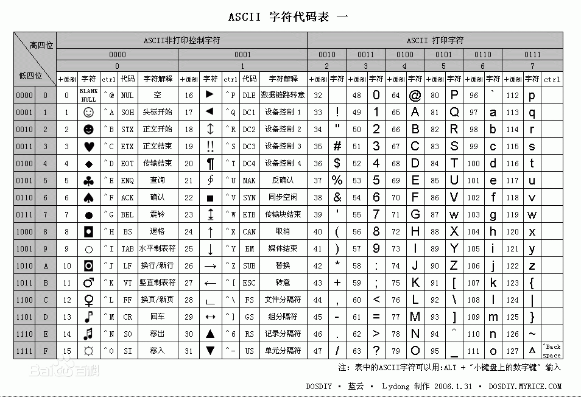

# 基本语法
## py文件规范
### 添加编码
默认情况下，Python 3 源码文件以 UTF-8 编码，所有字符串都是 unicode 
 + `# -*- coding: UTF-8 -*-`
 + `#coding=utf-8`
 > 注意：#coding=utf-8 的 = 号两边不要空格
### 添加解释器
```
# 如果在linux环境中，使用./xx.py 去执行，必须加上，告诉系统使用什么解释器运行xx.py文件
#!/usr/bin/python                #默认使用的是系统自带的python，不建议写死，默认升级自己安装的在/usr/local/xxxx下面
#!/user/bin/env python 
```
## 字符编码
+ python解释器在加载 .py 文件中的代码时，会对内容进行编码（默认ascill）
ASCII（American Standard Code for Information Interchange，美国标准信息交换代码）是基于拉丁字母的一套电脑编码系统，主要用于显示现代英语和其他西欧语言，其最多只能用 8 位来表示（一个字节），即：2**8 = 256-1，所以，ASCII码最多只能表示 255 个符号


+ 关于中文
为了处理汉字，程序员设计了用于简体中文的GB2312和用于繁体中文的big5。
GB2312(1980年)一共收录了7445个字符，包括6763个汉字和682个其它符号。汉字区的内码范围高字节从B0-F7，低字节从A1-FE，占用的码位是72*94=6768。其中有5个空位是D7FA-D7FE。
GB2312 支持的汉字太少。1995年的汉字扩展规范GBK1.0收录了21886个符号，它分为汉字区和图形符号区。汉字区包括21003个字符。2000年的 GB18030是取代GBK1.0的正式国家标准。该标准收录了27484个汉字，同时还收录了藏文、蒙文、维吾尔文等主要的少数民族文字。现在的PC平台必须支持GB18030，对嵌入式产品暂不作要求。所以手机、MP3一般只支持GB2312。
从ASCII、GB2312、GBK 到GB18030，这些编码方法是向下兼容的，即同一个字符在这些方案中总是有相同的编码，后面的标准支持更多的字符。在这些编码中，英文和中文可以统一地处理。区分中文编码的方法是高字节的最高位不为0。按照程序员的称呼，GB2312、GBK到GB18030都属于双字节字符集 (DBCS)。
有的中文Windows的缺省内码还是GBK，可以通过GB18030升级包升级到GB18030。不过GB18030相对GBK增加的字符，普通人是很难用到的，通常我们还是用GBK指代中文Windows内码

+ 显然ASCII码无法将世界上的各种文字和符号全部表示，所以，就需要新出一种可以代表所有字符和符号的编码，即：Unicode
Unicode（统一码、万国码、单一码）是一种在计算机上使用的字符编码。Unicode 是为了解决传统的字符编码方案的局限而产生的，它为每种语言中的每个字符设定了统一并且唯一的二进制编码，规定虽有的字符和符号最少由 16 位来表示（2个字节），即：2 **16 = 65536，
注：此处说的的是最少2个字节，可能更多
UTF-8，是对Unicode编码的压缩和优化，他不再使用最少使用2个字节，而是将所有的字符和符号进行分类：ascii码中的内容用1个字节保存、欧洲的字符用2个字节保存，东亚的字符用3个字节保存...
所以，python解释器在加载 .py 文件中的代码时，会对内容进行编码（默认ascill），如果是如下代码的话：
+ 报错：ascii码无法表示中文
```
#!/usr/bin/env python
print "你好，世界"
```
+ 改正：应该显示的告诉python解释器，用什么编码来执行源代码，即：
```
#!/usr/bin/env python
# -*- coding: utf-8 -*-
print "你好，世界"
```
# Refer
+ [python](https://www.python.org/)
+ [pythondoc](http://www.pythondoc.com/)
+ [runoob](http://www.runoob.com/python3/python3-errors-execptions.html)
+ [pythonav](http://www.pythonav.com)